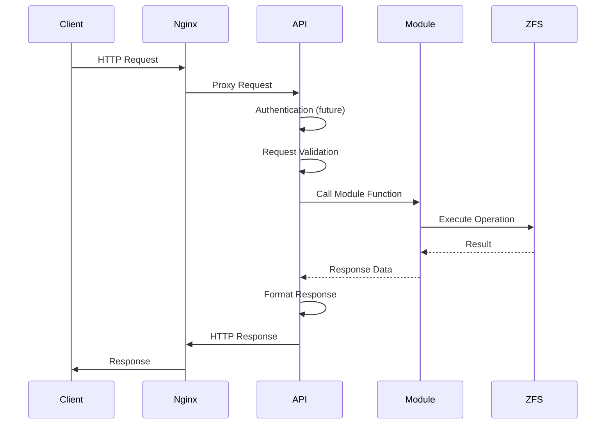
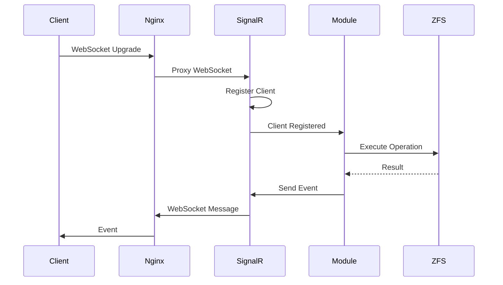
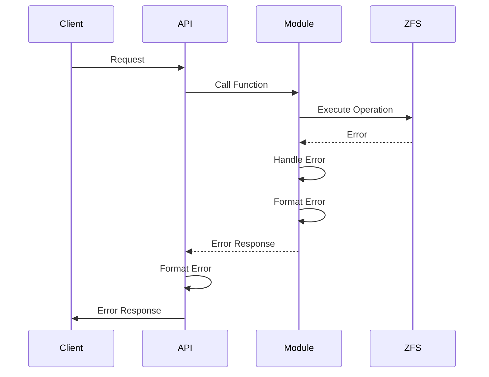
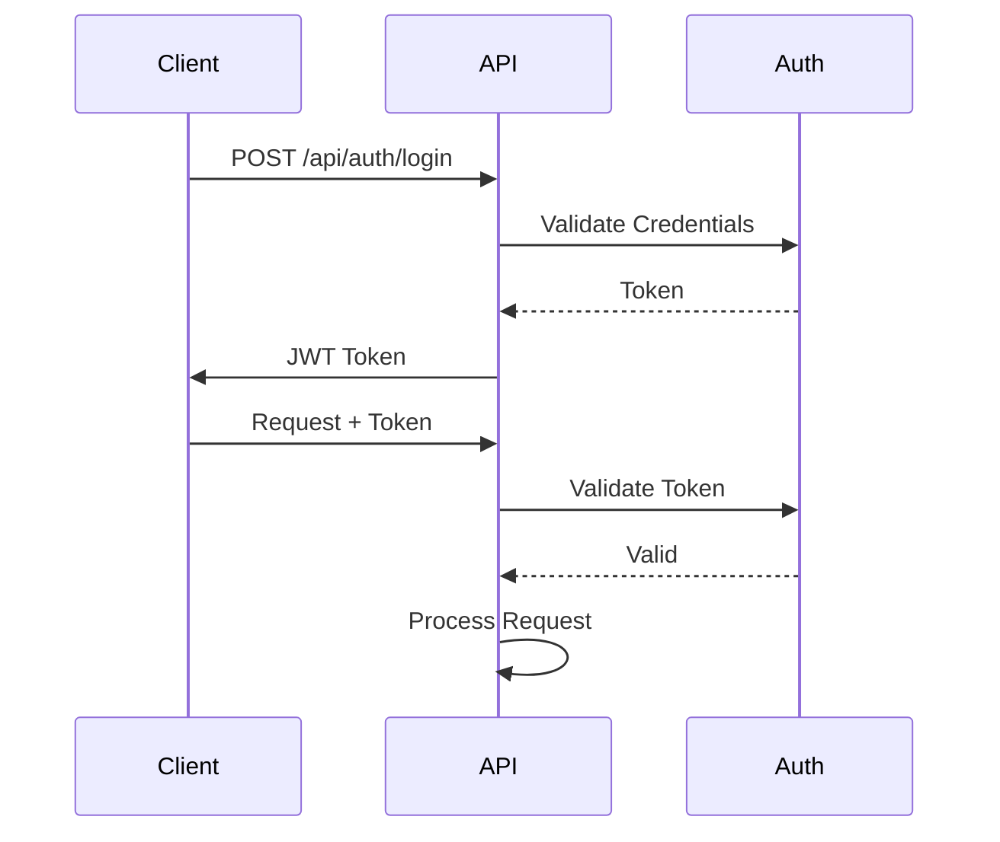

# API Workflow

The API workflow describes the request/response flow through the ggnet2 REST API and WebSocket/SignalR communication.

## Request Flow

### REST API Request Flow



### WebSocket/SignalR Flow



## API Endpoints

### Image Management

**Create Image:**
```
POST /api/images
Request: { name, type, size }
Response: { id, name, type, size, created_at }
```

**List Images:**
```
GET /api/images
Response: { images: [...] }
```

**Get Image:**
```
GET /api/images/{id}
Response: { id, name, type, size, snapshots, ... }
```

**Delete Image:**
```
DELETE /api/images/{id}
Response: { success: true }
```

### VM Management

**Create VM:**
```
POST /api/vms
Request: { name, system_image, game_image, vcpus, ram, boot_mode, drives_connection }
Response: { id, name, status, ... }
```

**List VMs:**
```
GET /api/vms
Response: { vms: [...] }
```

**Start VM:**
```
POST /api/vms/{id}/start
Response: { success: true }
```

**Stop VM:**
```
POST /api/vms/{id}/stop
Response: { success: true }
```

### Machine Management

**Register Machine:**
```
POST /api/machines
Request: { mac, name, ip }
Response: { id, name, mac, ip, ... }
```

**List Machines:**
```
GET /api/machines
Response: { machines: [...] }
```

**Wake-On-LAN:**
```
POST /api/machines/{id}/turn-on
Response: { success: true }
```

### Storage Management

**Get Pool Status:**
```
GET /api/array/pool
Response: { pool_name, status, size, allocated, free, health, ... }
```

**Start Scrub:**
```
POST /api/array/pool/scrub
Response: { success: true }
```

**Get ARC Stats:**
```
GET /api/array/arc/stats
Response: { available, method, hits, misses, hit_rate, ... }
```

## WebSocket Events

### Client Events

**Register:**
```json
{
  "event": "register",
  "data": {
    "client_id": "client-001",
    "mac": "00:11:22:33:44:55",
    "ip": "192.168.1.100",
    "name": "PC-1"
  }
}
```

**Status Update:**
```json
{
  "event": "status",
  "data": {
    "client_id": "client-001",
    "status": "online",
    "uptime": "02:30:45",
    "speed": "100Mbps"
  }
}
```

**Heartbeat:**
```json
{
  "event": "heartbeat",
  "data": {
    "client_id": "client-001",
    "timestamp": "2024-01-01T12:00:00Z"
  }
}
```

### Server Events

**Command:**
```json
{
  "event": "command",
  "data": {
    "client_id": "client-001",
    "command": "rename_pc",
    "params": {
      "new_name": "PC-1-Updated"
    }
  }
}
```

**VM Status:**
```json
{
  "event": "vm_status",
  "data": {
    "vm_id": "vm-001",
    "status": "running",
    "uptime": "01:30:00"
  }
}
```

**Broadcast:**
```json
{
  "event": "broadcast",
  "data": {
    "message": "System maintenance in 5 minutes"
  }
}
```

## Error Handling

### Error Response Format

```json
{
  "error": {
    "code": "ERROR_CODE",
    "message": "Human-readable error message",
    "details": {}
  }
}
```

### Common Error Codes

- `400`: Bad Request
- `401`: Unauthorized
- `404`: Not Found
- `409`: Conflict
- `500`: Internal Server Error

### Error Handling Flow



## Authentication (Future)

### JWT Token Flow



## Development Notes

- API uses FastAPI for REST endpoints
- WebSocket/SignalR provides real-time communication
- Error handling is centralized
- Authentication will be implemented in future
- Request validation uses Pydantic models

## To-Do

- [ ] Implement JWT authentication
- [ ] Add API rate limiting
- [ ] Implement request caching
- [ ] Add API versioning
- [ ] Implement request logging
- [ ] Add API metrics collection

