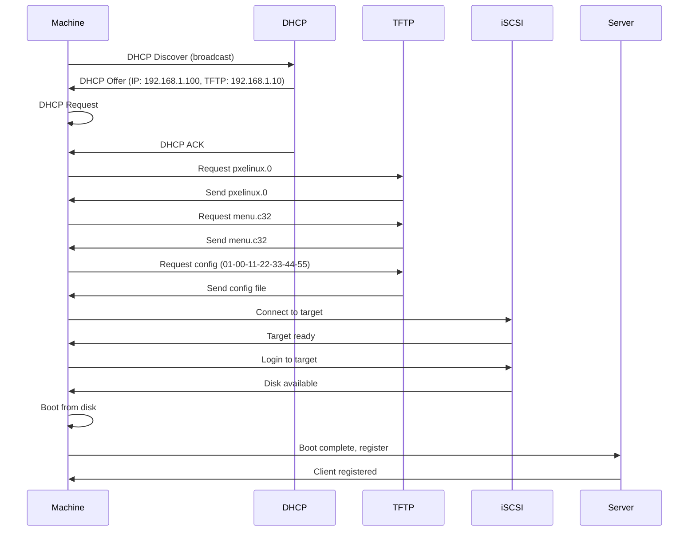
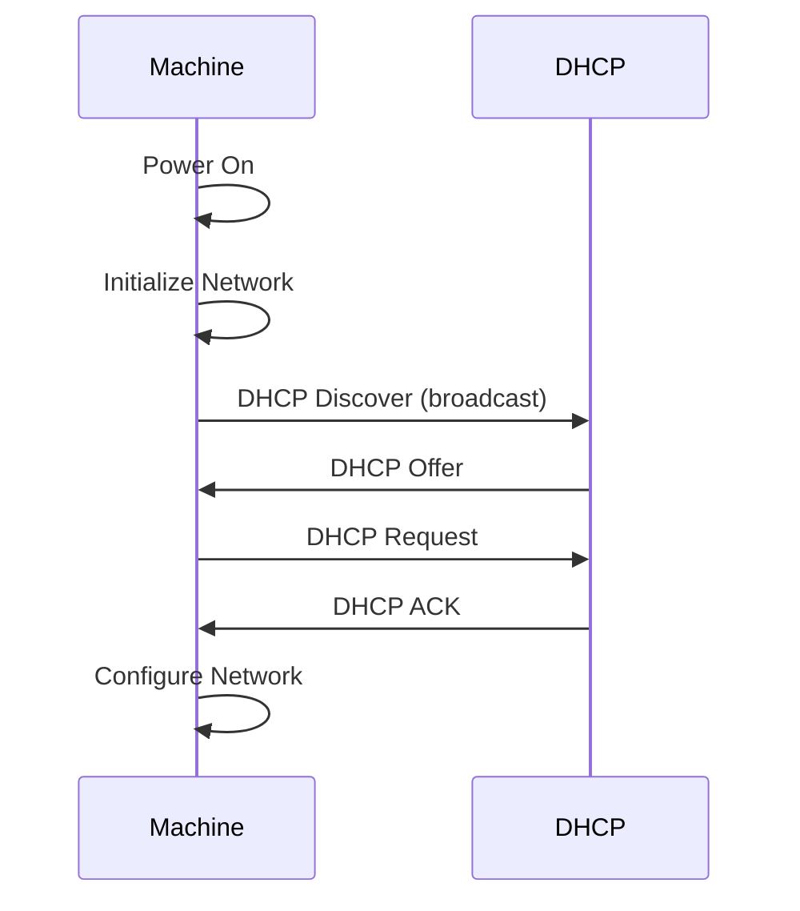
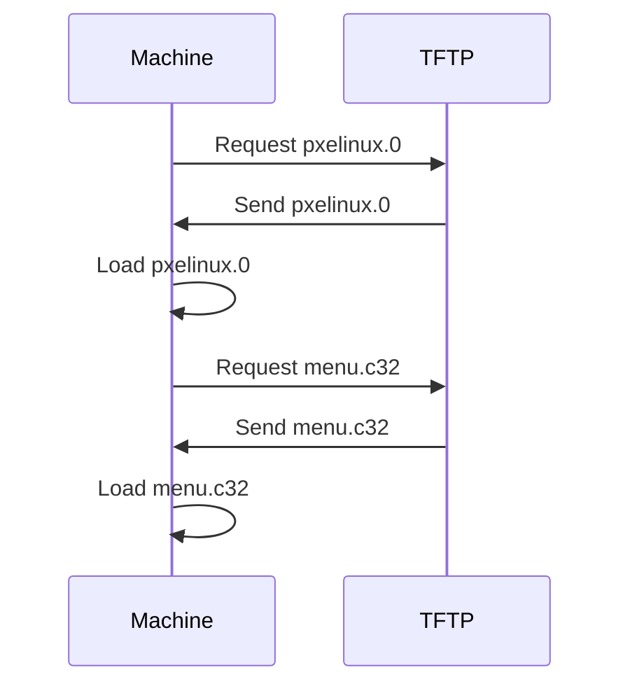
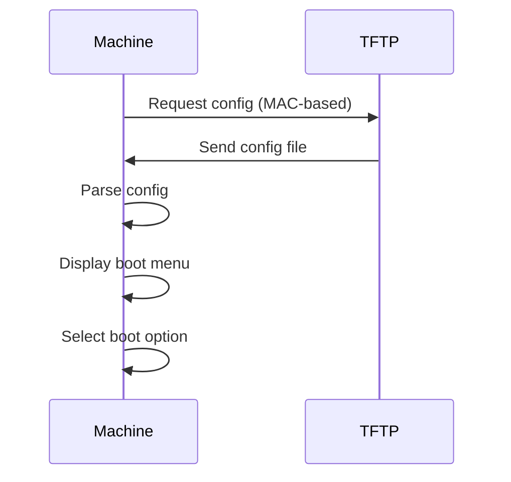
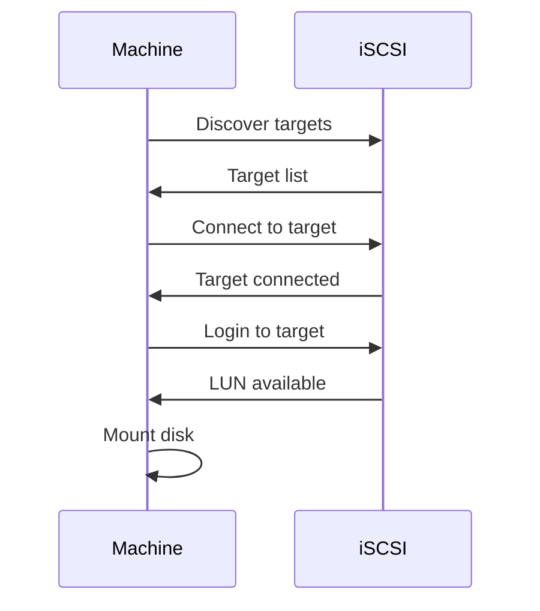
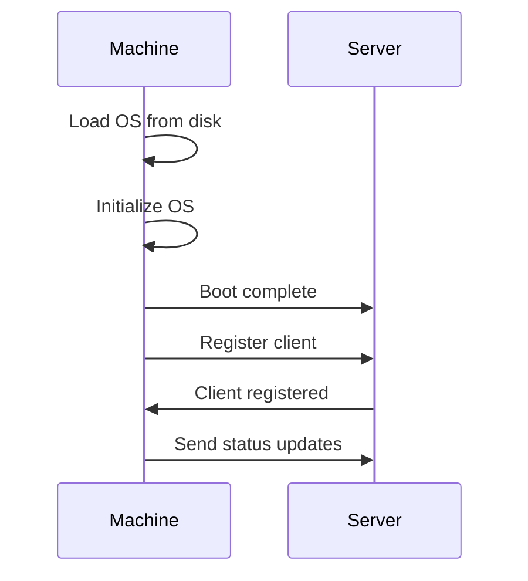
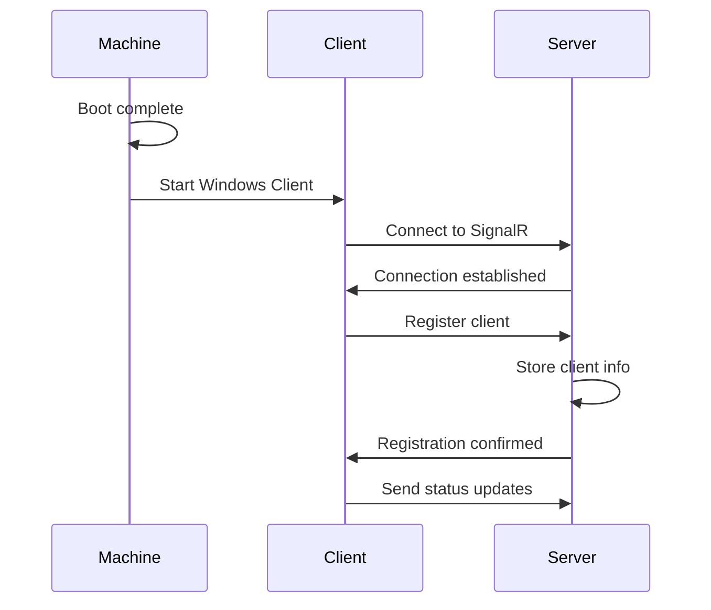

# PXE Boot Sequence

The PXE boot sequence describes how physical machines boot from the network using PXE boot and iSCSI.

## PXE Boot Process

### Complete Boot Sequence



## DHCP Configuration

### DHCP Discover

**Machine Request:**
```
DHCP Discover (broadcast)
- Client MAC: 00:11:22:33:44:55
- Client ID: 00:11:22:33:44:55
```

**DHCP Server Response:**
```
DHCP Offer
- IP Address: 192.168.1.100
- Subnet Mask: 255.255.255.0
- Gateway: 192.168.1.1
- DNS Server: 192.168.1.1
- TFTP Server: 192.168.1.10
- Boot File: pxelinux.0
```

### DHCP Configuration

**dnsmasq Configuration:**
```
dhcp-range=192.168.1.100,192.168.1.200,12h
dhcp-option=option:router,192.168.1.1
dhcp-option=option:dns-server,192.168.1.1
dhcp-boot=pxelinux.0
enable-tftp
tftp-root=/tftpboot
```

## TFTP Configuration

### PXE Boot Files

**TFTP Root Structure:**
```
/tftpboot/
├── pxelinux.0              # PXE bootloader
├── menu.c32                # Menu system
├── memdisk                 # Memory disk loader
└── pxelinux.cfg/
    ├── default             # Default boot config
    └── 01-00-11-22-33-44-55  # Machine-specific config
```

### PXE Configuration File

**Machine-Specific Config:**
```
default win11
prompt 0
timeout 10

label win11
    kernel memdisk
    append initrd=win11.img raw
    ipappend 2
```

**MAC Address Format:**
- MAC: `00:11:22:33:44:55`
- Config file: `01-00-11-22-33-44-55` (prefixed with `01-`)

## iSCSI Target Setup

### iSCSI Target Configuration

**Target Creation:**
```bash
# Create iSCSI target
targetcli /backstores/block create name=machine-001-system \
  dev=/dev/zvol/pool0/ggnet2/clones/machine-001-system

# Create iSCSI target IQN
targetcli /iscsi create iqn.2024-01.ggnet2:machine-001

# Create LUN
targetcli /iscsi/iqn.2024-01.ggnet2:machine-001/tpg1/luns \
  create /backstores/block/machine-001-system
```

### iSCSI Connection

**Machine Connection:**
```
iSCSI Target: iqn.2024-01.ggnet2:machine-001
iSCSI Portal: 192.168.1.10:3260
LUN: 0
```

## Boot Sequence Details

### Phase 1: Network Discovery



### Phase 2: PXE Bootloader



### Phase 3: Boot Configuration



### Phase 4: iSCSI Connection



### Phase 5: OS Boot



## Client Registration

### Registration Flow



## Boot Configuration

### Machine-Specific Configuration

**PXE Config Generation:**
```python
# Generate PXE config for machine
pxe_config = f"""
default {system_image}
prompt 0
timeout 10

label {system_image}
    kernel memdisk
    append initrd={system_image}.img raw
    ipappend 2
"""

# Save to TFTP root
config_path = f"/tftpboot/pxelinux.cfg/01-{mac_address.replace(':', '-')}"
with open(config_path, 'w') as f:
    f.write(pxe_config)
```

## Troubleshooting

### Boot Fails at DHCP

**Check DHCP:**
```bash
# Check dnsmasq status
systemctl status dnsmasq

# Check DHCP leases
cat /var/lib/dhcp/dhcpd.leases

# Check network connectivity
ping machine_ip
```

### Boot Fails at TFTP

**Check TFTP:**
```bash
# Check TFTP server
systemctl status tftpd-hpa

# Check TFTP files
ls -la /tftpboot/

# Test TFTP
tftp localhost
get pxelinux.0
```

### Boot Fails at iSCSI

**Check iSCSI:**
```bash
# Check iSCSI target
systemctl status target

# List iSCSI targets
targetcli ls

# Check iSCSI connections
iscsiadm -m session
```

## Development Notes

- PXE boot requires network connectivity
- DHCP provides IP and TFTP server address
- TFTP serves boot files
- iSCSI provides disk images
- Client registration completes boot process

## To-Do

- [ ] Add PXE boot menu customization
- [ ] Implement DHCP reservations
- [ ] Add network boot image support
- [ ] Implement iSCSI target automation
- [ ] Add boot logging
- [ ] Implement boot monitoring

