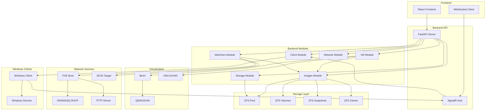
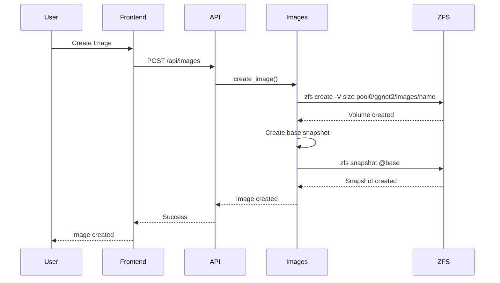
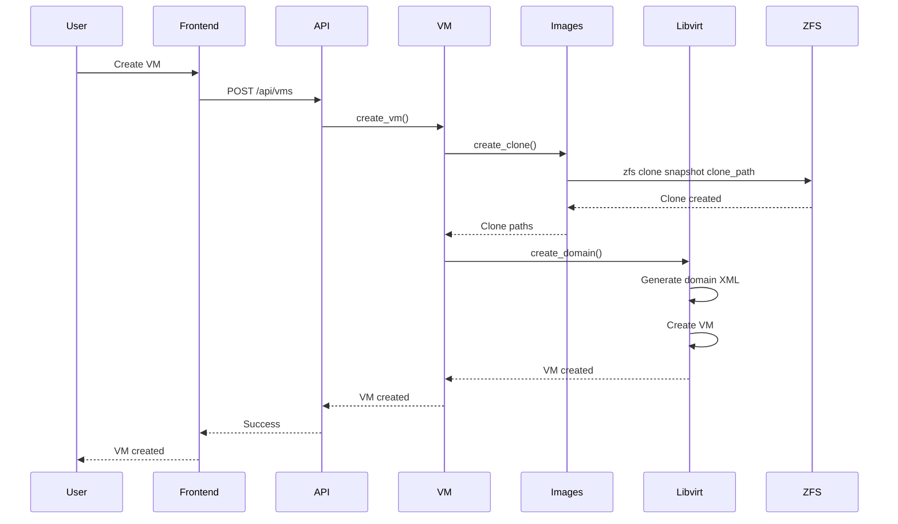
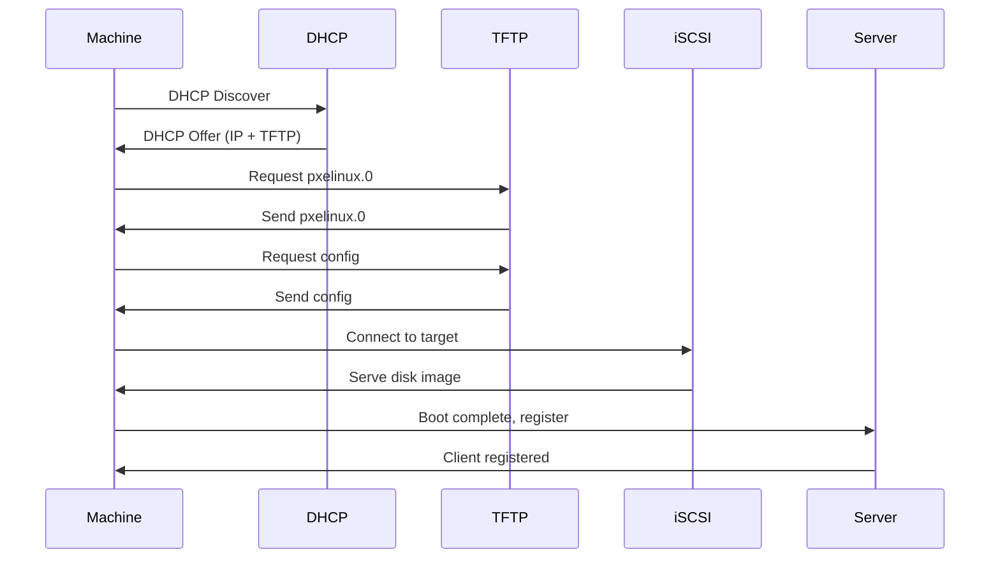

# System Overview

The ggnet2 system is a ZFS-based storage management platform for disk images and virtual/physical machine management.

## Architecture Diagram

## System Components

### Frontend

- **React Application**: User interface for managing the system
- **WebSocket Client**: Real-time updates via WebSocket/SignalR
- **API Client**: HTTP requests to backend API

### Backend API

- **FastAPI Server**: REST API for system operations
- **SignalR Hub**: WebSocket hub for real-time communication
- **API Routes**: Endpoints for images, VMs, machines, storage, clients

### Backend Modules

- **Images Module**: Image management and ZFS operations
- **VM Module**: Virtual machine lifecycle management
- **Machines Module**: Physical machine management
- **Storage Module**: ZFS pool management and monitoring
- **Network Module**: PXE boot and network configuration
- **Client Module**: Windows client management

### Storage Layer

- **ZFS Pool**: Storage pool for images and clones
- **ZFS Volumes**: Block devices for images
- **ZFS Snapshots**: Point-in-time copies of images
- **ZFS Clones**: Copy-on-write clones for VMs/machines

### Virtualization

- **libvirt**: Virtualization management library
- **QEMU/KVM**: Hypervisor for virtual machines
- **VNC/noVNC**: Console access for VMs

### Network Services

- **PXE Boot**: Network boot server for physical machines
- **DHCP**: IP address allocation via dnsmasq
- **TFTP**: Boot file serving
- **iSCSI**: Block storage over network for machines

### Windows Clients

- **Windows Client**: Client application for physical machines
- **Windows Service**: Background service for client operations

## Data Flow

### Image Creation Flow

### VM Creation Flow

### Physical Machine Boot Flow

## Communication Patterns

### REST API

- **HTTP/HTTPS**: Standard REST API communication
- **JSON**: Request/response format
- **Authentication**: JWT tokens (future)

### WebSocket/SignalR

- **Real-time Updates**: Status updates, commands
- **Persistent Connection**: Maintains connection for real-time communication
- **Event-based**: Event-driven communication

### ZFS Operations

- **Command-line**: ZFS operations via subprocess
- **Parsing**: Parse ZFS command outputs
- **Error Handling**: Handle ZFS errors

## System Integration

### Images ↔ VMs

- VMs use clones from Images module
- Images module creates clones for VMs
- VM deletion cleans up clones

### Images ↔ Machines

- Physical machines use clones from Images module
- Images module creates clones for machines
- Machine deletion cleans up clones

### VMs ↔ libvirt

- VM module uses libvirt for VM operations
- libvirt manages QEMU/KVM instances
- VNC/noVNC provides console access

### Machines ↔ PXE

- Machines module configures PXE boot
- PXE boot uses iSCSI targets for disk images
- Network module manages PXE configuration

### Clients ↔ Server

- Windows clients connect via SignalR
- Server sends commands to clients
- Clients report status to server

## Development Notes

- System uses modular architecture for maintainability
- ZFS provides storage layer for images and clones
- libvirt manages virtualization layer
- PXE boot enables network boot for physical machines
- SignalR provides real-time communication

## To-Do

- [ ] Add system monitoring and metrics
- [ ] Implement system backup and recovery
- [ ] Add system health checks
- [ ] Implement system logging and auditing
- [ ] Add system performance optimization
- [ ] Implement system security hardening

