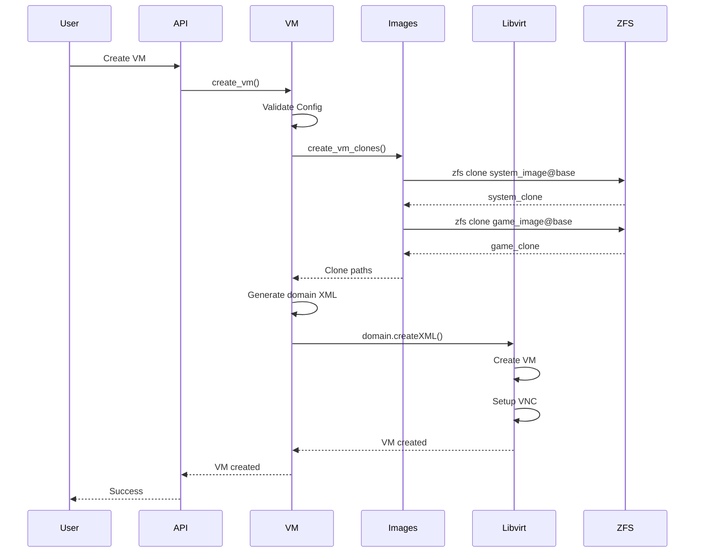
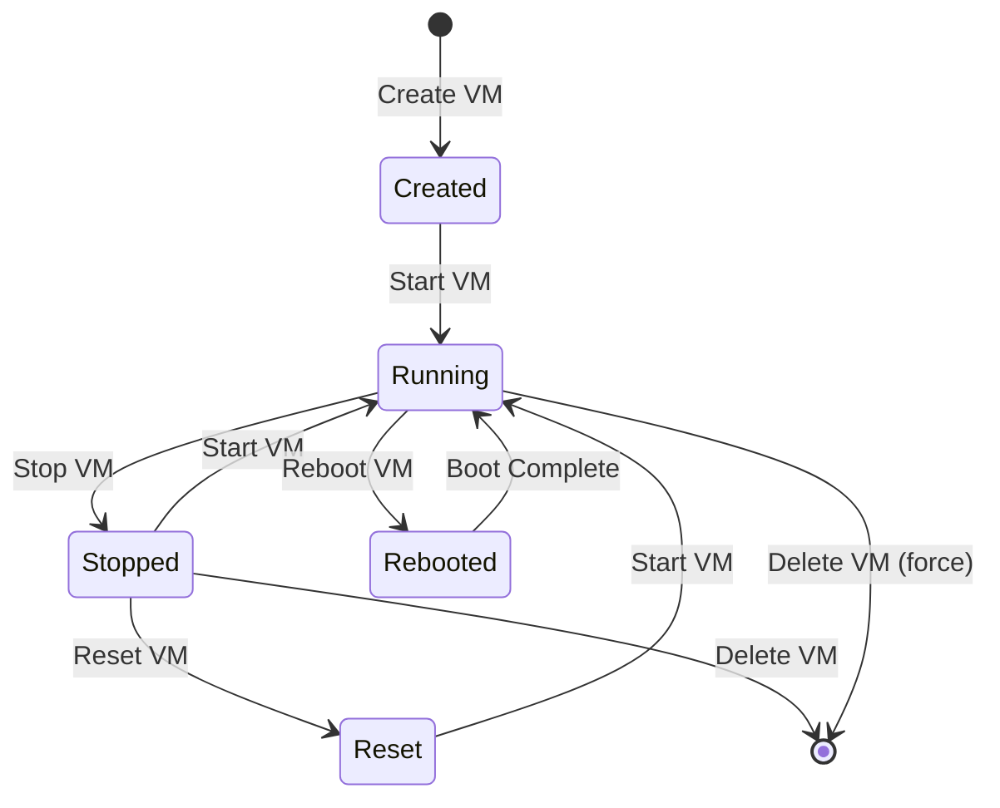
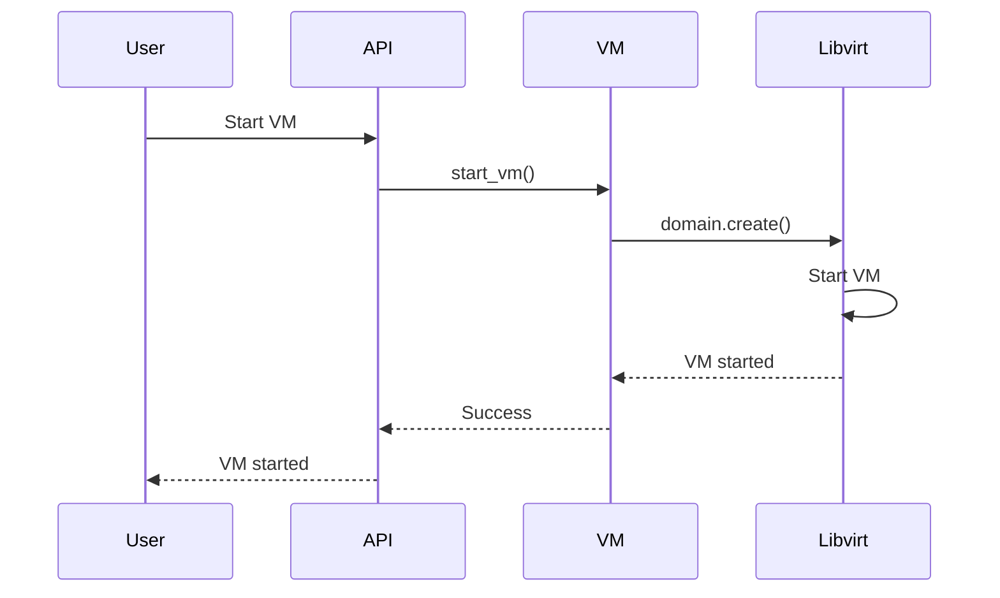
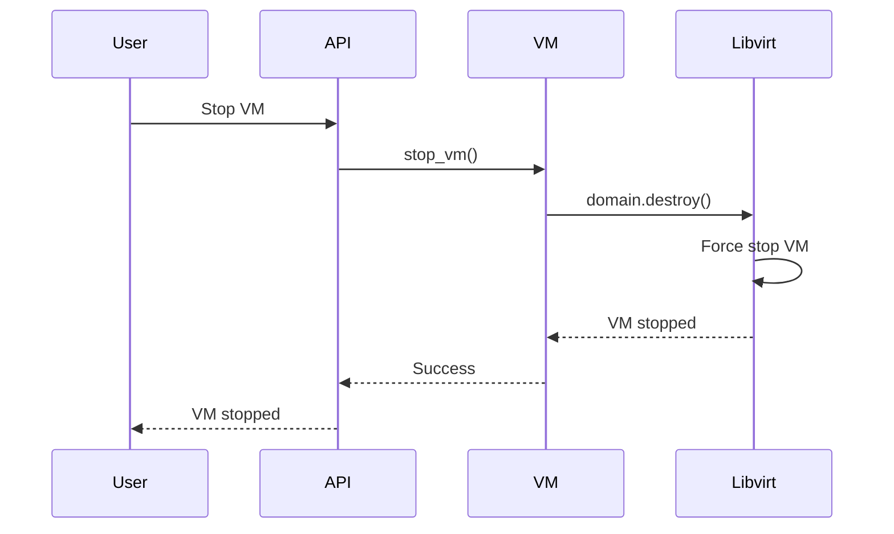
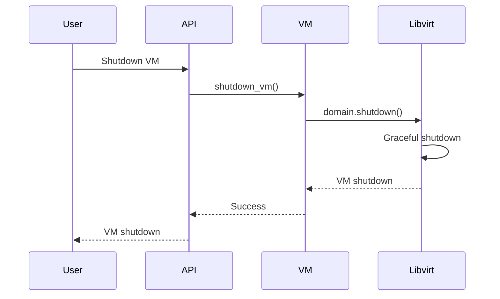
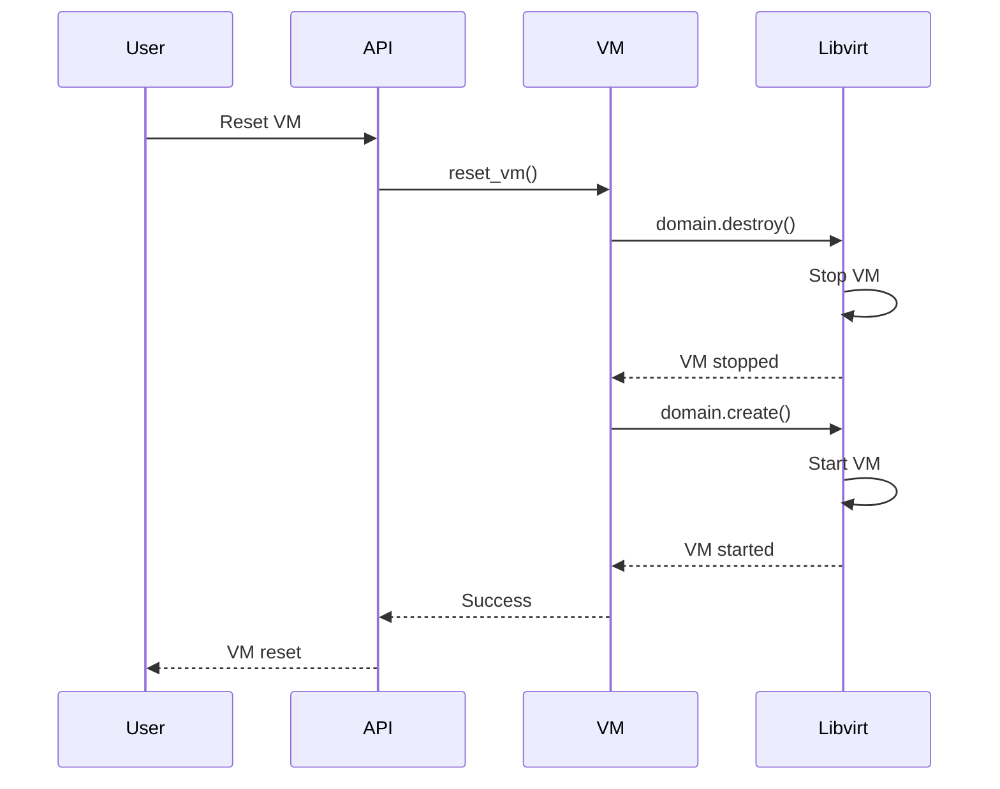
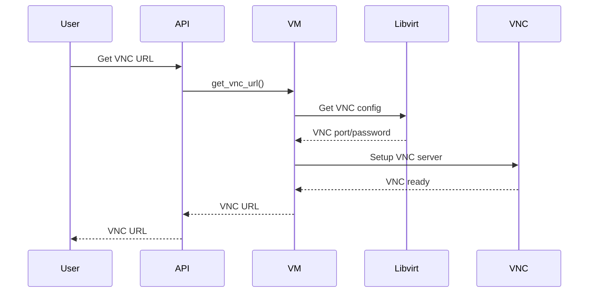
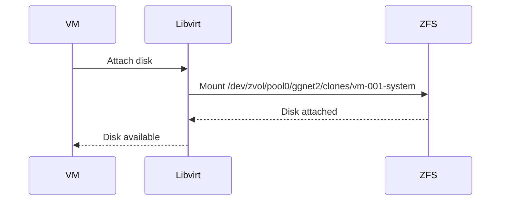
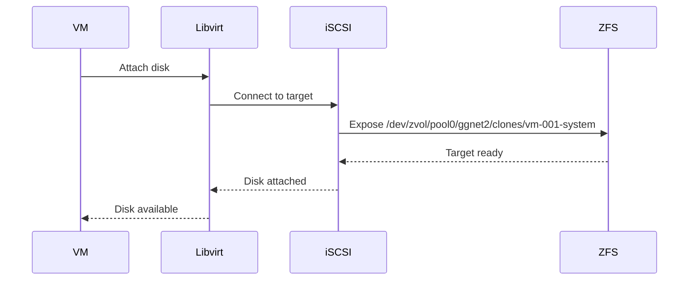
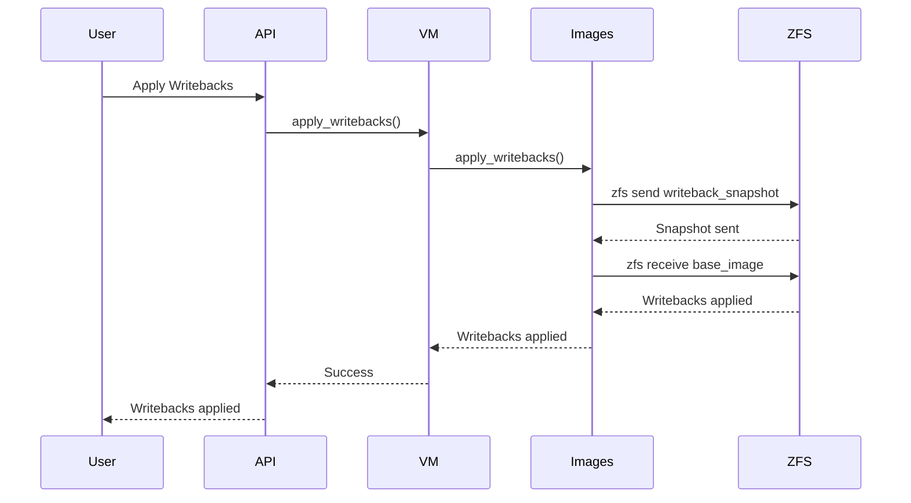

# VM Workflow

The VM workflow describes the lifecycle of virtual machines, from creation to deletion, including VM control operations.

## VM Lifecycle

### VM Creation Flow



### VM State Transitions



## VM Operations

### Start VM



### Stop VM



### Shutdown VM



### Reset VM



## VM Control Operations

### VNC Setup Flow



### VM Console Access

**VNC Connection:**
```
VNC Server: localhost:5900
VNC Password: generated_password
noVNC URL: ws://localhost:6080/vnc.html?host=localhost&port=5900
```

## VM Network Configuration

### Local Drives Mode



**Configuration:**
- Direct attachment of ZFS volumes
- Maximum performance
- No network overhead

### Network Mode



**Configuration:**
- iSCSI target setup
- Network boot support
- Useful for troubleshooting

## VM Resource Management

### CPU Allocation

**vCPU Allocation:**
- Each vCPU consumes one CPU thread
- Minimum: 2 vCPUs (recommended)
- Maximum: Based on available CPU threads

### RAM Allocation

**RAM Allocation:**
- Minimum: 4GB (recommended)
- Maximum: 32GB per VM
- Global limit: Maximum Boot RAM Size

### Storage Allocation

**Storage Allocation:**
- Clones use copy-on-write
- Base image data is shared
- Only changes are stored separately

## VM Writeback Management

### Apply Writebacks Flow



## VM Settings Management

### Update VM Settings

**Settings Update:**
- Name: Can be changed anytime
- System Image: Can be changed when VM is offline
- Game Image: Can be changed when VM is offline
- vCPUs: Can be changed when VM is offline
- RAM: Can be changed when VM is offline
- Boot Mode: Can be changed when VM is offline
- Drives Connection: Can be changed when VM is offline

## Development Notes

- VM creation requires ZFS clones
- libvirt manages VM lifecycle
- VNC provides console access
- Network mode uses iSCSI targets
- Writebacks enable change tracking

## To-Do

- [ ] Implement VM migration
- [ ] Add VM snapshots (libvirt)
- [ ] Implement VM templates
- [ ] Add VM resource monitoring
- [ ] Implement VM autostart
- [ ] Add VM backup/restore

