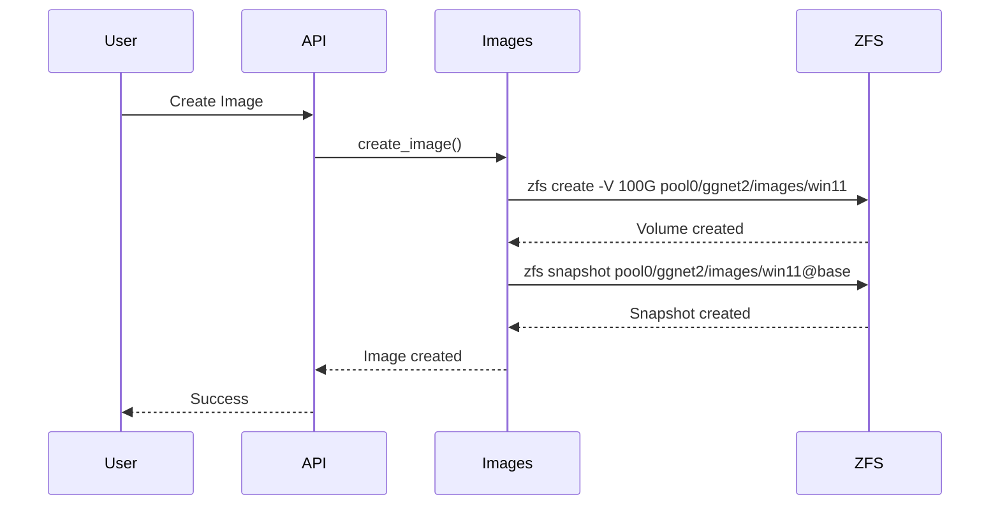
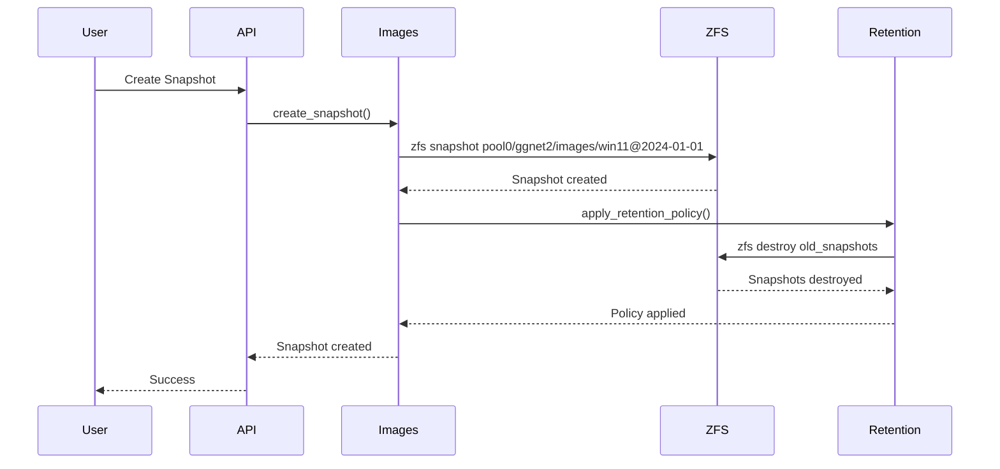
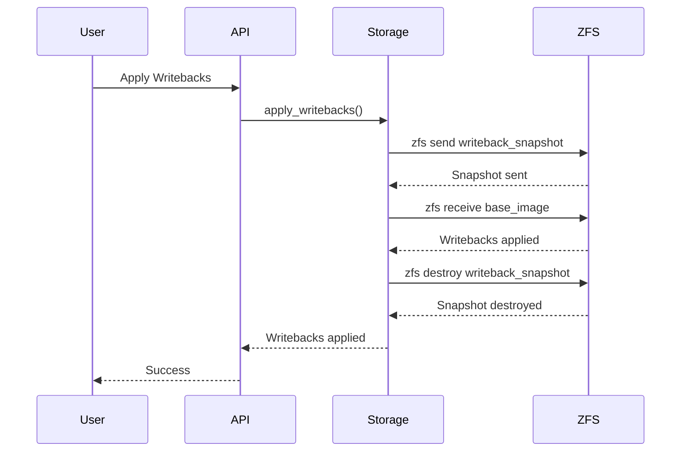
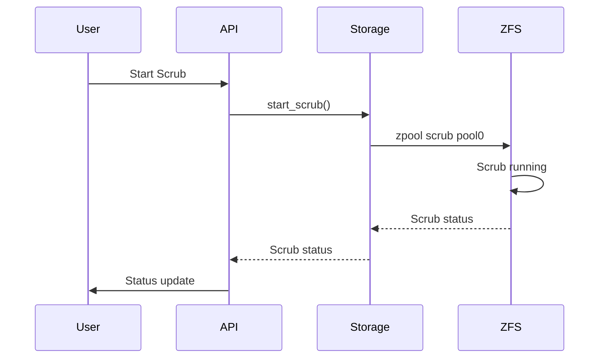
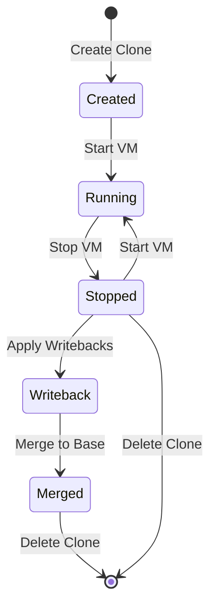
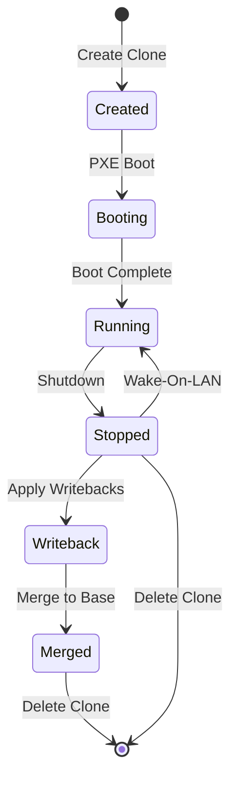

# ZFS Workflow

The ZFS workflow describes how ZFS operations are used for image management, cloning, and snapshot management.

## ZFS Structure

### Pool Structure

```
pool0/
└── ggnet2/
    ├── images/
    │   ├── win11          # System image (zvol)
    │   └── games          # Game image (zvol)
    └── clones/
        ├── vm-001-system   # VM clone (zvol)
        ├── vm-001-game     # VM clone (zvol)
        ├── machine-001-system # Machine clone (zvol)
        └── machine-001-game   # Machine clone (zvol)
```

### Snapshot Structure

```
pool0/ggnet2/images/win11@base              # Base snapshot
pool0/ggnet2/images/win11@2024-01-01         # Date snapshot
pool0/ggnet2/images/win11@2024-01-01-120000  # Timestamp snapshot
```

## Image Creation Flow



### ZFS Commands

**Create Volume:**
```bash
zfs create -V 100G \
  -o compression=lz4 \
  -o volblocksize=32K \
  -o mountpoint=none \
  pool0/ggnet2/images/win11
```

**Create Snapshot:**
```bash
zfs snapshot pool0/ggnet2/images/win11@base
```

## Clone Creation Flow

```mermaid
sequenceDiagram
    participant User
    participant API
    participant Images
    participant ZFS

    User->>API: Create Clone
    API->>Images: create_clone()
    Images->>ZFS: zfs clone pool0/ggnet2/images/win11@base \
                  pool0/ggnet2/clones/vm-001-system
    ZFS-->>Images: Clone created
    Images-->>API: Clone created
    API-->>User: Success
```

### ZFS Commands

**Create Clone:**
```bash
zfs clone pool0/ggnet2/images/win11@base \
  pool0/ggnet2/clones/vm-001-system
```

**Clone Properties:**
- Copy-on-write: Clones share base image data
- Space Efficient: Only changes are stored
- Fast Creation: Clones are created instantly

## Snapshot Management Flow



### Retention Policy

**Policy Rules:**
- Base snapshot: Never deleted
- Daily snapshots: Keep for 7 days
- Weekly snapshots: Keep for 4 weeks
- Monthly snapshots: Keep for 12 months

**Cleanup Process:**
```bash
# List snapshots
zfs list -t snapshot -r pool0/ggnet2/images/win11

# Destroy old snapshots
zfs destroy pool0/ggnet2/images/win11@2023-01-01
```

## Writeback Management Flow



### Writeback Operations

**Apply Writebacks:**
```bash
# Send writeback snapshot to base image
zfs send pool0/ggnet2/clones/vm-001-system@writeback-2024-01-01 | \
  zfs receive pool0/ggnet2/images/win11
```

**Discard Writebacks:**
```bash
# Destroy writeback snapshot
zfs destroy pool0/ggnet2/clones/vm-001-system@writeback-2024-01-01
```

## Pool Operations Flow



### Pool Operations

**Scrub:**
```bash
# Start scrub
zpool scrub pool0

# Check scrub status
zpool status pool0
```

**TRIM:**
```bash
# Enable autotrim
zpool set autotrim=on pool0

# Manual TRIM
zpool trim pool0
```

## Clone Lifecycle

### VM Clone Lifecycle



### Machine Clone Lifecycle



## ZFS Properties

### Volume Properties

**Images:**
- `compression=lz4`: Fast compression
- `volblocksize=32K`: Block size
- `mountpoint=none`: No mountpoint (zvol)

**Clones:**
- Inherit properties from parent
- Copy-on-write enabled
- Separate writeback space

### Pool Properties

**Pool:**
- `autotrim=on`: Enable autotrim for SSDs
- `compression=lz4`: Enable compression
- `scrub`: Data integrity checks

## Development Notes

- ZFS operations use subprocess for command execution
- ZFS command outputs are parsed for structured data
- Clones provide space-efficient copy-on-write
- Snapshots enable point-in-time recovery
- Writebacks enable change tracking

## To-Do

- [ ] Implement ZFS replication
- [ ] Add ZFS encryption
- [ ] Implement ZFS deduplication
- [ ] Add ZFS performance tuning
- [ ] Implement ZFS monitoring
- [ ] Add ZFS health checks

