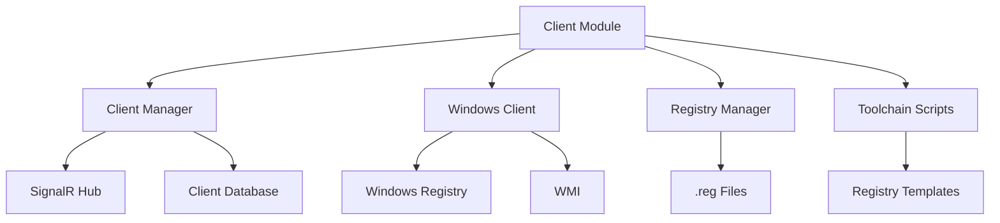

# Client Management Module

The Client Management module handles Windows client operations, registry management, and toolchain script generation.

## Overview

The Clients module handles:

- **Client Registration**: Registering Windows clients with the server
- **Registry Management**: Generating Windows Registry scripts (.reg files)
- **Toolchain Scripts**: Creating registry scripts for client configuration
- **Client Communication**: Managing client-server communication via SignalR
- **PC Management**: Hostname renaming, environment variable injection

## Architecture



## Components

### Client Manager (`client_manager.py`)

High-level API for client management operations.

**Key Functions:**
- `register_client(mac, name, ip)`: Register a new client
- `list_clients()`: List all registered clients
- `get_client(client_id)`: Get client details
- `update_client(client_id, settings)`: Update client settings
- `delete_client(client_id)`: Delete a client
- `get_client_status(client_id)`: Get real-time client status

**Client Structure:**
```python
{
    "id": "client-001",
    "name": "PC-1",
    "mac": "00:11:22:33:44:55",
    "ip": "192.168.1.100",
    "status": "online",
    "uptime": "02:30:45",
    "last_seen": "2024-01-01T12:00:00Z",
    "client_version": "1.0.0",
    "needs_configuration": False
}
```

**Example:**
```python
from clients.client_manager import ClientManager

client_manager = ClientManager()
client = client_manager.register_client(
    mac="00:11:22:33:44:55",
    name="PC-1",
    ip="192.168.1.100"
)
```

### Windows Client (`windows_client.py`)

Handles Windows-specific client operations.

**Key Functions:**
- `rename_pc(client_id, new_name)`: Rename PC hostname
- `inject_environment_variables(client_id, env_vars)`: Inject environment variables
- `execute_command(client_id, command)`: Execute command on client
- `get_system_info(client_id)`: Get system information from client

**Example:**
```python
from clients.windows_client import WindowsClient

windows_client = WindowsClient()
windows_client.rename_pc("client-001", "PC-1-Updated")
windows_client.inject_environment_variables(
    client_id="client-001",
    env_vars={
        "GGNET2_SERVER": "http://server:8000",
        "GGNET2_CLIENT_ID": "client-001"
    }
)
```

### Registry Manager (`registry_manager.py`)

Handles Windows Registry operations and script generation.

**Key Functions:**
- `generate_registry_script(script_type, params)`: Generate registry script
- `validate_registry_script(script_content)`: Validate registry script
- `apply_registry_script(client_id, script_content)`: Apply registry script to client

**Registry Script Types:**
- `install`: Install ggnet2-toolchain service
- `shell`: Custom shell configuration
- `rename_pc`: PC hostname renaming
- `inject_env`: Environment variable injection
- `uac_disable`: UAC disable (optional)

**Example:**
```python
from clients.registry_manager import RegistryManager

registry_manager = RegistryManager()
script = registry_manager.generate_registry_script(
    script_type="install",
    params={
        "computer_name": "PC-1",
        "server_url": "http://server:8000",
        "client_id": "client-001"
    }
)
```

### Toolchain Scripts (`toolchain_scripts.py`)

Generates registry scripts from templates.

**Key Functions:**
- `generate_install_script(params)`: Generate install script
- `generate_shell_script(params)`: Generate shell script
- `generate_rename_pc_script(params)`: Generate rename PC script
- `generate_inject_env_script(params)`: Generate inject env script

**Template System:**
```python
REGISTRY_TEMPLATES = {
    "install": """
Windows Registry Editor Version 5.00

[HKEY_LOCAL_MACHINE\\SOFTWARE\\ggnet2]
"ServerURL"="{SERVER_URL}"
"ClientID"="{CLIENT_ID}"
"ComputerName"="{COMPUTER_NAME}"
""",
    "rename_pc": """
Windows Registry Editor Version 5.00

[HKEY_LOCAL_MACHINE\\SYSTEM\\CurrentControlSet\\Control\\ComputerName\\ComputerName]
"ComputerName"="{COMPUTER_NAME}"
"""
}
```

**Placeholder Replacement:**
- `{COMPUTER_NAME}`: PC hostname
- `{ENV_VARIABLES}`: Environment variables
- `{SERVER_URL}`: Server URL
- `{CLIENT_ID}`: Client UUID

**Example:**
```python
from clients.toolchain_scripts import ToolchainScripts

toolchain = ToolchainScripts()
install_script = toolchain.generate_install_script({
    "computer_name": "PC-1",
    "server_url": "http://server:8000",
    "client_id": "client-001"
})
```

## Registry Scripts

### Install Script

Installs ggnet2-toolchain service:

```python
install_script = registry_manager.generate_registry_script(
    script_type="install",
    params={
        "computer_name": "PC-1",
        "server_url": "http://server:8000",
        "client_id": "client-001"
    }
)
```

**Generated Script:**
```
Windows Registry Editor Version 5.00

[HKEY_LOCAL_MACHINE\SOFTWARE\ggnet2]
"ServerURL"="http://server:8000"
"ClientID"="client-001"
"ComputerName"="PC-1"
```

### Shell Script

Custom shell configuration:

```python
shell_script = registry_manager.generate_registry_script(
    script_type="shell",
    params={
        "shell_path": "C:\\Program Files\\ggnet2\\toolchain.exe"
    }
)
```

### Rename PC Script

PC hostname renaming:

```python
rename_script = registry_manager.generate_registry_script(
    script_type="rename_pc",
    params={
        "computer_name": "PC-1-Updated"
    }
)
```

### Inject Environment Variables Script

Environment variable injection:

```python
env_script = registry_manager.generate_registry_script(
    script_type="inject_env",
    params={
        "env_vars": {
            "GGNET2_SERVER": "http://server:8000",
            "GGNET2_CLIENT_ID": "client-001"
        }
    }
)
```

## Client Communication

### SignalR Hub

Clients communicate with server via SignalR:

```python
from api.websocket.hub import SignalRHub

hub = SignalRHub()

# Register client
hub.register_client(
    client_id="client-001",
    mac="00:11:22:33:44:55",
    ip="192.168.1.100"
)

# Send command to client
hub.send_command(
    client_id="client-001",
    command="rename_pc",
    params={"new_name": "PC-1-Updated"}
)
```

### Client Events

**Client Registration:**
```json
{
    "event": "register",
    "data": {
        "client_id": "client-001",
        "mac": "00:11:22:33:44:55",
        "ip": "192.168.1.100",
        "name": "PC-1"
    }
}
```

**Status Update:**
```json
{
    "event": "status",
    "data": {
        "client_id": "client-001",
        "status": "online",
        "uptime": "02:30:45",
        "speed": "100Mbps"
    }
}
```

**Heartbeat:**
```json
{
    "event": "heartbeat",
    "data": {
        "client_id": "client-001",
        "timestamp": "2024-01-01T12:00:00Z"
    }
}
```

### Server Commands

**Rename PC:**
```json
{
    "event": "command",
    "data": {
        "client_id": "client-001",
        "command": "rename_pc",
        "params": {
            "new_name": "PC-1-Updated"
        }
    }
}
```

**Inject Environment Variables:**
```json
{
    "event": "command",
    "data": {
        "client_id": "client-001",
        "command": "inject_env",
        "params": {
            "env_vars": {
                "GGNET2_SERVER": "http://server:8000"
            }
        }
    }
}
```

## Integration with Other Modules

### Machines Module

Client module manages Windows clients for physical machines:

```python
from clients.client_manager import ClientManager
from machines.physical_manager import PhysicalManager

client_manager = ClientManager()
physical_manager = PhysicalManager()

# Register client when machine is registered
machine = physical_manager.register_machine(
    mac="00:11:22:33:44:55",
    name="PC-1",
    ip="192.168.1.100"
)
client = client_manager.register_client(
    mac="00:11:22:33:44:55",
    name="PC-1",
    ip="192.168.1.100"
)
```

### Network Module

Client module uses network module for IP allocation:

```python
from network.ip_manager import IPManager
from clients.client_manager import ClientManager

ip_manager = IPManager()
client_manager = ClientManager()

# Allocate IP for client
ip = ip_manager.allocate_ip(
    machine_id="client-001",
    mac="00:11:22:33:44:55"
)
```

## Error Handling

**Common Errors:**
- **Client Already Exists**: Client with same MAC already registered
- **Registry Script Invalid**: Invalid registry script format
- **Client Not Connected**: Client not connected to SignalR hub
- **Command Execution Failed**: Failed to execute command on client

**Error Handling:**
```python
from clients.exceptions import ClientError, RegistryError

try:
    client = client_manager.register_client(mac, name, ip)
except ClientError as e:
    logger.error(f"Client registration failed: {e}")
except RegistryError as e:
    logger.error(f"Registry script generation failed: {e}")
```

## Development Notes

- Client registration is based on MAC address (unique identifier)
- Registry scripts are generated from templates with placeholder replacement
- Client communication uses SignalR for real-time updates
- Commands are executed on client via WMI/Registry operations
- Client status is updated in real-time via SignalR

## To-Do

- [ ] Implement client authentication
- [ ] Add client update mechanism
- [ ] Implement client grouping
- [ ] Add client health monitoring
- [ ] Implement client remote desktop
- [ ] Add client performance metrics

