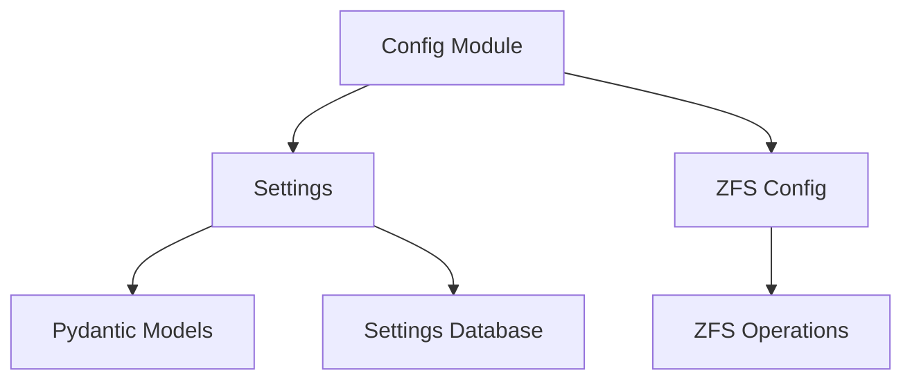

# Configuration Module

The Configuration module manages application settings and ZFS-specific configuration.

## Overview

The Config module handles:

- **Settings Management**: Application-wide settings using Pydantic models
- **ZFS Configuration**: ZFS-specific configuration (pool names, paths, etc.)
- **Settings Validation**: Validation of settings using Pydantic
- **Settings Persistence**: Loading and saving settings from/to files

## Architecture



## Components

### Settings (`settings.py`)

Manages application-wide settings using Pydantic models.

**Settings Structure:**
```python
from pydantic import BaseModel
from typing import Optional

class Settings(BaseModel):
    # ZFS Configuration
    pool_name: str = "pool0"
    default_volume_size: str = "100G"
    
    # VM Configuration
    max_vm_ram: str = "32G"
    vms_enabled: bool = False
    
    # Network Configuration
    pxe_enabled: bool = True
    dhcp_range_start: str = "192.168.1.100"
    dhcp_range_end: str = "192.168.1.200"
    
    # Storage Configuration
    autotrim: bool = True
    arc_stats_available: bool = True
    
    # Client Configuration
    client_registration_enabled: bool = True
    
    # API Configuration
    api_host: str = "0.0.0.0"
    api_port: int = 8000
    
    # Logging Configuration
    log_level: str = "INFO"
    log_file: str = "/var/log/ggnet2/ggnet2.log"
```

**Settings Functions:**
- `load_settings()`: Load settings from file/database
- `save_settings(settings)`: Save settings to file/database
- `get_settings()`: Get current settings
- `update_settings(updates)`: Update settings
- `validate_settings(settings)`: Validate settings

**Example:**
```python
from config.settings import Settings, load_settings, save_settings

# Load settings
settings = load_settings()

# Update settings
settings.max_vm_ram = "64G"
settings.vms_enabled = True

# Save settings
save_settings(settings)
```

### ZFS Config (`zfs_config.py`)

Manages ZFS-specific configuration.

**ZFS Configuration:**
```python
class ZFSConfig:
    # Pool Configuration
    pool_name: str = "pool0"
    
    # Dataset Structure
    base_path: str = "pool0/ggnet2"
    images_path: str = "pool0/ggnet2/images"
    clones_path: str = "pool0/ggnet2/clones"
    
    # Volume Configuration
    default_volume_size: str = "100G"
    default_compression: str = "lz4"
    default_volblocksize: str = "32K"
    
    # Snapshot Configuration
    snapshot_naming: str = "@{name}"  # @base, @2024-01-01
    base_snapshot_name: str = "@base"
    
    # TRIM Configuration
    autotrim_enabled: bool = True
    
    # ARC Configuration
    arc_stats_available: bool = True
    arc_stats_method: str = "procfs"  # procfs, sysctl, iostat_fallback
```

**ZFS Config Functions:**
- `get_pool_name()`: Get ZFS pool name
- `get_images_path()`: Get images dataset path
- `get_clones_path()`: Get clones dataset path
- `get_image_dataset_path(image_name)`: Get image dataset path
- `get_clone_dataset_path(clone_name)`: Get clone dataset path

**Example:**
```python
from config.zfs_config import ZFSConfig

zfs_config = ZFSConfig()

# Get paths
pool_name = zfs_config.get_pool_name()
images_path = zfs_config.get_images_path()
clone_path = zfs_config.get_clone_dataset_path("vm-001-system")
```

## Settings Management

### Loading Settings

Settings can be loaded from:
- **File**: JSON/YAML file (e.g., `/etc/ggnet2/settings.json`)
- **Database**: SQLite/PostgreSQL database
- **Environment Variables**: Environment variables with `GGNET2_` prefix

**Load from File:**
```python
from config.settings import load_settings

settings = load_settings(config_file="/etc/ggnet2/settings.json")
```

**Load from Environment:**
```python
import os

# Environment variables
os.environ["GGNET2_POOL_NAME"] = "pool0"
os.environ["GGNET2_MAX_VM_RAM"] = "64G"

settings = load_settings()
```

### Saving Settings

Settings can be saved to:
- **File**: JSON/YAML file
- **Database**: SQLite/PostgreSQL database

**Save to File:**
```python
from config.settings import save_settings, Settings

settings = Settings(
    pool_name="pool0",
    max_vm_ram="64G"
)
save_settings(settings, config_file="/etc/ggnet2/settings.json")
```

### Updating Settings

Update settings programmatically:

```python
from config.settings import get_settings, update_settings

settings = get_settings()
update_settings({
    "max_vm_ram": "64G",
    "vms_enabled": True
})
```

## Settings Validation

Settings are validated using Pydantic:

```python
from config.settings import Settings, ValidationError

try:
    settings = Settings(
        pool_name="pool0",
        max_vm_ram="64G",
        api_port=8000
    )
except ValidationError as e:
    print(f"Settings validation failed: {e}")
```

**Validation Rules:**
- `pool_name`: Must be valid ZFS pool name
- `max_vm_ram`: Must be valid size string (e.g., "32G", "64G")
- `api_port`: Must be between 1 and 65535
- `dhcp_range_start/end`: Must be valid IP addresses

## Configuration Files

### Settings File

**Location**: `/etc/ggnet2/settings.json`

**Format:**
```json
{
    "pool_name": "pool0",
    "default_volume_size": "100G",
    "max_vm_ram": "32G",
    "vms_enabled": false,
    "pxe_enabled": true,
    "dhcp_range_start": "192.168.1.100",
    "dhcp_range_end": "192.168.1.200",
    "autotrim": true,
    "arc_stats_available": true,
    "client_registration_enabled": true,
    "api_host": "0.0.0.0",
    "api_port": 8000,
    "log_level": "INFO",
    "log_file": "/var/log/ggnet2/ggnet2.log"
}
```

### ZFS Config

ZFS configuration is typically stored in code (constants):

```python
# config/zfs_config.py
class ZFSConfig:
    pool_name: str = "pool0"
    base_path: str = "pool0/ggnet2"
    images_path: str = "pool0/ggnet2/images"
    clones_path: str = "pool0/ggnet2/clones"
```

## Integration

All modules use configuration:

```python
# Images module
from config.zfs_config import ZFSConfig
from config.settings import get_settings

zfs_config = ZFSConfig()
settings = get_settings()

image_path = zfs_config.get_image_dataset_path("win11")
max_size = settings.default_volume_size
```

## Error Handling

**Configuration Errors:**
```python
from config.exceptions import ConfigError

try:
    settings = load_settings()
except ConfigError as e:
    logger.error(f"Configuration loading failed: {e}")
```

## Development Notes

- Settings use Pydantic for validation and type safety
- Configuration files are loaded on startup
- Settings can be updated at runtime via API
- ZFS configuration is typically static (constants)
- Environment variables override file settings

## To-Do

- [ ] Add settings encryption for sensitive data
- [ ] Implement settings versioning
- [ ] Add settings migration support
- [ ] Implement settings backup/restore
- [ ] Add settings validation rules
- [ ] Implement settings import/export

