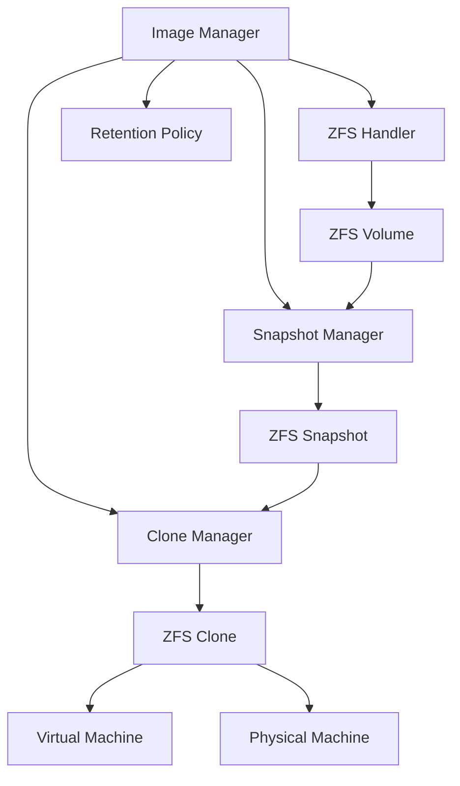
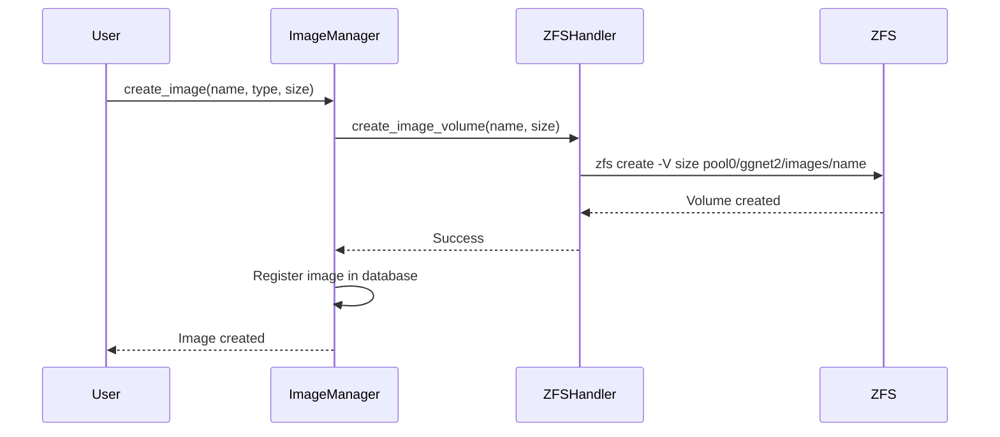
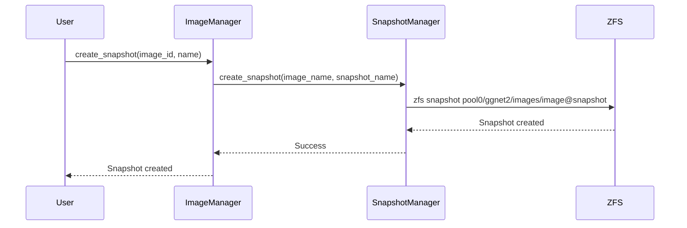
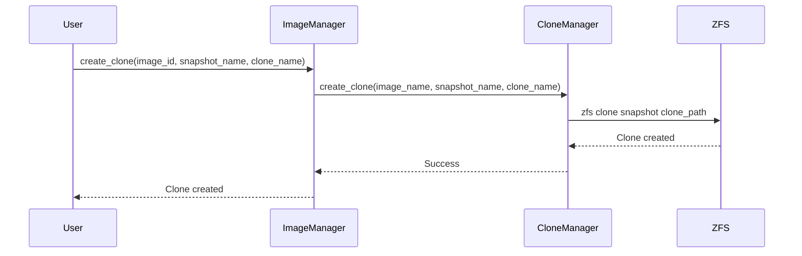

# Images Module

The Images module manages disk images (System and Game images) using ZFS volumes, snapshots, and clones. It provides the foundation for both virtual machines and physical client machines.

## Overview

The Images module handles:

- **Image Creation**: Creating ZFS volumes (`zvol`) for disk images
- **Snapshot Management**: Creating and managing snapshots with retention policies
- **Clone Operations**: Creating clones for VMs and physical machines
- **Image Registration**: Registering images in the system database
- **Writeback Management**: Handling writebacks from clients/VMs

## Architecture



## Components

### Image Manager (`image_manager.py`)

High-level API for image management operations.

**Key Functions:**
- `create_image(name, type, size)`: Create a new image
- `list_images()`: List all registered images
- `get_image(image_id)`: Get image details
- `delete_image(image_id)`: Delete an image
- `register_image(name, type, zfs_path)`: Register an existing ZFS volume as an image

**Example:**
```python
from images.image_manager import ImageManager

manager = ImageManager()
image = manager.create_image(
    name="win11",
    type="system",
    size="100G"
)
```

### ZFS Handler (`zfs_handler.py`)

Handles low-level ZFS volume operations.

**Key Functions:**
- `create_image_volume(image_name, size)`: Create ZFS volume (`zvol`)
- `destroy_image_volume(image_name)`: Destroy ZFS volume
- `get_volume_info(image_name)`: Get volume information
- `list_volumes()`: List all image volumes

**ZFS Volume Structure:**
```
pool0/ggnet2/images/win11    # ZFS volume (zvol)
pool0/ggnet2/images/games    # ZFS volume (zvol)
```

**ZFS Commands:**
```bash
# Create ZFS volume
zfs create -V 100G -o compression=lz4 -o volblocksize=32K \
  -o mountpoint=none pool0/ggnet2/images/win11

# List volumes
zfs list -t volume -r pool0/ggnet2/images

# Get volume info
zfs get all pool0/ggnet2/images/win11
```

### Snapshot Manager (`snapshot_manager.py`)

Manages ZFS snapshots for images.

**Key Functions:**
- `create_snapshot(image_name, snapshot_name)`: Create a snapshot
- `list_snapshots(image_name)`: List all snapshots for an image
- `get_snapshot_info(image_name, snapshot_name)`: Get snapshot details
- `destroy_snapshot(image_name, snapshot_name)`: Destroy a snapshot
- `rollback_to_snapshot(image_name, snapshot_name)`: Rollback image to snapshot

**Snapshot Naming Convention:**
- `@base`: Base snapshot (created after initial image setup)
- `@YYYY-MM-DD`: Date-based snapshots (e.g., `@2024-01-01`)
- `@YYYY-MM-DD-HHMMSS`: Timestamp-based snapshots (e.g., `@2024-01-01-120000`)

**ZFS Commands:**
```bash
# Create snapshot
zfs snapshot pool0/ggnet2/images/win11@base

# List snapshots
zfs list -t snapshot -r pool0/ggnet2/images/win11

# Destroy snapshot
zfs destroy pool0/ggnet2/images/win11@2024-01-01
```

### Clone Manager (`clone_manager.py`)

Handles clone operations for VMs and physical machines.

**Key Functions:**
- `create_clone(image_name, snapshot_name, clone_name)`: Create a clone from snapshot
- `list_clones(image_name)`: List all clones for an image
- `get_clone_info(clone_name)`: Get clone details
- `destroy_clone(clone_name)`: Destroy a clone
- `promote_clone(clone_name)`: Promote clone to independent filesystem

**Clone Structure:**
```
pool0/ggnet2/images/win11@base          # Snapshot
pool0/ggnet2/clones/vm-001-system       # VM clone
pool0/ggnet2/clones/machine-001-system  # Physical machine clone
```

**ZFS Commands:**
```bash
# Create clone
zfs clone pool0/ggnet2/images/win11@base \
  pool0/ggnet2/clones/vm-001-system

# List clones
zfs list -r pool0/ggnet2/clones

# Promote clone
zfs promote pool0/ggnet2/clones/vm-001-system
```

### Snapshot Retention (`snapshot_retention.py`)

Manages snapshot retention policies.

**Key Functions:**
- `create_base_snapshot(image_name, image_type)`: Create base snapshot
- `apply_retention_policy(image_name)`: Apply retention policy
- `cleanup_old_snapshots(image_name, max_age_days)`: Cleanup old snapshots

**Retention Policies:**
- **Base Snapshot**: Always kept (never deleted)
- **Daily Snapshots**: Keep for 7 days
- **Weekly Snapshots**: Keep for 4 weeks
- **Monthly Snapshots**: Keep for 12 months

**Example:**
```python
from images.snapshot_retention import SnapshotRetention

retention = SnapshotRetention()
retention.create_base_snapshot("win11", "system")
retention.apply_retention_policy("win11")
```

## Image Types

### System Images

System images contain the operating system (Windows, Linux, etc.).

**Characteristics:**
- Typically 50-200GB in size
- Contains OS installation
- Used for booting physical machines and VMs
- Base snapshot created after OS installation

### Game Images

Game images contain games and applications.

**Characteristics:**
- Typically 100-500GB in size
- Contains games and applications
- Mounted as additional drive in VMs/physical machines
- Base snapshot created after initial game installation

## Workflow

### Creating an Image



### Creating a Snapshot



### Creating a Clone



## Integration with Other Modules

### VM Module

The Images module provides clones for VMs:

```python
from images.clone_manager import CloneManager
from machines.vm_manager import VMManager

clone_manager = CloneManager()
vm_manager = VMManager()

# Create clone for VM
clone_path = clone_manager.create_clone(
    image_name="win11",
    snapshot_name="@base",
    clone_name="vm-001-system"
)

# Create VM with clone
vm = vm_manager.create_vm(
    name="VM-1",
    system_image_clone=clone_path,
    ...
)
```

### Physical Machines Module

The Images module provides clones for physical machines:

```python
# Create clone for physical machine
clone_path = clone_manager.create_clone(
    image_name="win11",
    snapshot_name="@base",
    clone_name="machine-001-system"
)

# Physical machine uses clone via PXE boot
```

### Storage Module

The Images module uses the Storage module for ZFS pool operations:

```python
from storage.zfs_pool_manager import ZFSPoolManager

pool_manager = ZFSPoolManager()
pool_status = pool_manager.get_pool_status("pool0")
```

## Writeback Management

Writebacks are changes made by clients/VMs that are stored separately from the base image.

**Writeback Structure:**
```
pool0/ggnet2/clones/vm-001-system@writeback-2024-01-01
```

**Writeback Operations:**
- **Apply Writebacks**: Merge writebacks back into base image
- **Discard Writebacks**: Discard writebacks without merging
- **Keep Writebacks**: Keep writebacks for later application

See [Storage Management](storage.md) for writeback cleanup operations.

## Error Handling

**Common Errors:**
- **Volume Already Exists**: Image with same name already exists
- **Insufficient Space**: Not enough space in ZFS pool
- **Snapshot Not Found**: Snapshot does not exist
- **Clone Already Exists**: Clone with same name already exists

**Error Handling:**
```python
from images.exceptions import ImageError, SnapshotError, CloneError

try:
    image = manager.create_image("win11", "system", "100G")
except ImageError as e:
    logger.error(f"Failed to create image: {e}")
```

## Development Notes

- All ZFS operations use `subprocess` to execute `zfs` commands
- Image metadata is stored in a database (SQLite/PostgreSQL)
- Snapshot retention policies run on a schedule (daily)
- Clones are automatically cleaned up when VMs/machines are deleted

## To-Do

- [ ] Implement image metadata caching
- [ ] Add image integrity checking (checksums)
- [ ] Implement incremental snapshot backups
- [ ] Add image compression optimization
- [ ] Implement image cloning progress tracking
- [ ] Add image versioning support

