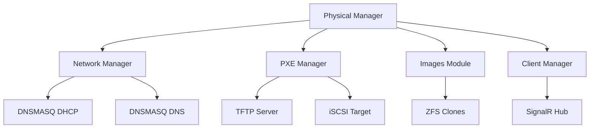
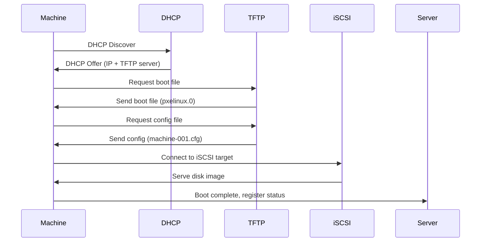

# Physical Machines Module

The Physical Machines module manages physical client machines that boot via PXE. It handles machine registration, boot configuration, and real-time status monitoring.

## Overview

The Physical Machines module handles:

- **Machine Registration**: Registering physical machines by MAC address
- **PXE Boot Configuration**: Configuring PXE boot for machines
- **Machine Status**: Real-time status monitoring (online/offline, uptime, speed)
- **Wake-On-LAN**: Powering on machines remotely
- **Machine Settings**: Configuring images, snapshots, and other settings
- **Bulk Operations**: Managing multiple machines simultaneously

## Architecture



## Components

### Physical Manager (`physical_manager.py`)

High-level API for physical machine management.

**Key Functions:**
- `register_machine(mac, name, ip)`: Register a new machine
- `list_machines()`: List all registered machines
- `get_machine(machine_id)`: Get machine details
- `update_machine(machine_id, settings)`: Update machine settings
- `delete_machine(machine_id)`: Delete a machine
- `wake_on_lan(machine_id)`: Send Wake-On-LAN packet
- `get_machine_status(machine_id)`: Get real-time machine status

**Machine Structure:**
```python
{
    "id": "machine-001",
    "name": "PC-1",
    "mac": "00:11:22:33:44:55",
    "ip": "192.168.1.100",
    "system_image": "win11",
    "game_image": "games",
    "system_image_snapshot": "@base",
    "game_image_snapshot": "@base",
    "status": "online",
    "uptime": "02:30:45",
    "sent": "50G",
    "received": "5G",
    "speed": "100Mbps",
    "link_speed": "1Gbps",
    "hidden": False,
    "keep_writebacks": False
}
```

**Example:**
```python
from machines.physical_manager import PhysicalManager

manager = PhysicalManager()
machine = manager.register_machine(
    mac="00:11:22:33:44:55",
    name="PC-1",
    ip="192.168.1.100"
)
```

## PXE Boot Configuration

### PXE Boot Process



### PXE Configuration Files

**TFTP Root Structure:**
```
/tftpboot/
├── pxelinux.0              # PXE bootloader
├── pxelinux.cfg/
│   ├── default             # Default boot config
│   └── 01-00-11-22-33-44-55  # Machine-specific config (MAC address)
└── menu.c32                # Menu system
```

**Machine-Specific Config:**
```
default win11
label win11
    kernel memdisk
    append initrd=win11.img raw
    ipappend 2
```

### iSCSI Target Setup

iSCSI targets expose ZFS clones to machines:

```python
from machines.physical_manager import PhysicalManager

manager = PhysicalManager()
manager.setup_iscsi_target(
    machine_id="machine-001",
    system_clone="/dev/zvol/pool0/ggnet2/clones/machine-001-system",
    game_clone="/dev/zvol/pool0/ggnet2/clones/machine-001-game"
)
```

**iSCSI Target Configuration:**
```bash
# Create iSCSI target
targetcli /backstores/block create name=machine-001-system \
  dev=/dev/zvol/pool0/ggnet2/clones/machine-001-system

targetcli /iscsi create iqn.2024-01.ggnet2:machine-001

targetcli /iscsi/iqn.2024-01.ggnet2:machine-001/tpg1/luns \
  create /backstores/block/machine-001-system
```

## Machine Status Monitoring

### Real-time Status

Machine status is updated in real-time via SignalR:

```python
from machines.physical_manager import PhysicalManager

manager = PhysicalManager()
status = manager.get_machine_status("machine-001")
# Returns: {
#   "status": "online",
#   "uptime": "02:30:45",
#   "speed": "100Mbps",
#   "sent": "50G",
#   "received": "5G"
# }
```

### Status Indicators

**Power State:**
- `online`: Machine is powered on and connected
- `offline`: Machine is powered off
- `unknown`: Machine status unknown

**Status Icons:**
- **Green Circle**: Machine on current snapshot, will switch to new snapshot on restart
- **Red Arrow -> Green Circle**: Machine on old snapshot, will switch to new snapshot on restart (if writeback applied)
- **Red Arrow -> Red Circle**: Machine on old snapshot, won't switch on restart (custom snapshot)
- **Green Arrow -> Red Circle**: Machine on current snapshot, will switch to older snapshot on restart (custom snapshot)

## Wake-On-LAN

Wake-On-LAN allows powering on machines remotely:

```python
from machines.physical_manager import PhysicalManager

manager = PhysicalManager()
manager.wake_on_lan("machine-001")
```

**Wake-On-LAN Packet:**
```
Magic Packet: FF FF FF FF FF FF + MAC address repeated 16 times
```

**Implementation:**
```python
import socket

def send_wol_packet(mac_address, broadcast_ip="255.255.255.255"):
    mac_bytes = bytes.fromhex(mac_address.replace(":", ""))
    magic_packet = b"\xFF" * 6 + mac_bytes * 16
    
    sock = socket.socket(socket.AF_INET, socket.SOCK_DGRAM)
    sock.setsockopt(socket.SOL_SOCKET, socket.SO_BROADCAST, 1)
    sock.sendto(magic_packet, (broadcast_ip, 9))
    sock.close()
```

## Machine Settings

### System Image and Game Image

Machines can be configured with different images:

```python
manager.update_machine("machine-001", {
    "system_image": "win11-updated",
    "game_image": "games-updated",
    "system_image_snapshot": "@base",
    "game_image_snapshot": "@2024-01-01"
})
```

### Advanced Settings

**Keep Writebacks:**
- If enabled, writebacks are kept after shutdown
- If disabled, writebacks are discarded on next boot

**Hide Machine:**
- Hide machine from Machines table
- Machine still exists in system but not visible in UI

**Custom Snapshots:**
- Use specific snapshots instead of base snapshots
- Allows testing different image versions

## Bulk Operations

### Bulk Selection

Select multiple machines for bulk operations:

```python
manager.bulk_operation(
    machine_ids=["machine-001", "machine-002", "machine-003"],
    operation="reboot"
)
```

### Bulk Settings Update

Update settings for multiple machines:

```python
manager.bulk_update_settings(
    machine_ids=["machine-001", "machine-002"],
    settings={
        "system_image": "win11-updated",
        "game_image": "games-updated"
    }
)
```

## Integration with Other Modules

### Images Module

Physical machines use clones from the Images module:

```python
from images.clone_manager import CloneManager

clone_manager = CloneManager()
clone_manager.create_clone(
    image_name="win11",
    snapshot_name="@base",
    clone_name="machine-001-system"
)
```

### Network Module

Physical machines use PXE boot from the Network module:

```python
from network.pxe_manager import PXEManager

pxe_manager = PXEManager()
pxe_manager.configure_machine_boot(
    machine_id="machine-001",
    mac="00:11:22:33:44:55",
    system_image="win11"
)
```

### Clients Module

Physical machines communicate via Windows Client:

```python
from clients.client_manager import ClientManager

client_manager = ClientManager()
client_manager.register_client(
    machine_id="machine-001",
    mac="00:11:22:33:44:55",
    ip="192.168.1.100"
)
```

## Writeback Management

Writebacks are changes made by physical machines that are stored separately:

```python
# Apply writebacks to base image
manager.apply_writebacks("machine-001")

# Discard writebacks
manager.discard_writebacks("machine-001")

# Keep writebacks for later
manager.keep_writebacks("machine-001")
```

See [Storage Management](storage.md) for writeback cleanup operations.

## Error Handling

**Common Errors:**
- **Machine Already Exists**: Machine with same MAC already registered
- **PXE Configuration Failed**: Failed to create PXE config file
- **iSCSI Target Failed**: Failed to create iSCSI target
- **Wake-On-LAN Failed**: Network error sending WOL packet

**Error Handling:**
```python
from machines.exceptions import MachineError, PXEError

try:
    machine = manager.register_machine(mac, name, ip)
except MachineError as e:
    logger.error(f"Machine registration failed: {e}")
except PXEError as e:
    logger.error(f"PXE configuration failed: {e}")
```

## Development Notes

- Machine registration is based on MAC address (unique identifier)
- PXE configuration files are generated dynamically
- Machine status is updated via SignalR in real-time
- Wake-On-LAN requires network interface to support WOL
- iSCSI targets are created/destroyed dynamically

## To-Do

- [ ] Implement machine grouping (machine groups)
- [ ] Add machine scheduling (automatic boot/shutdown)
- [ ] Implement machine health monitoring
- [ ] Add machine performance metrics
- [ ] Implement machine backup/restore
- [ ] Add machine template support

