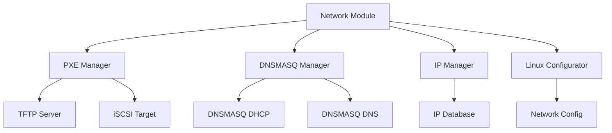
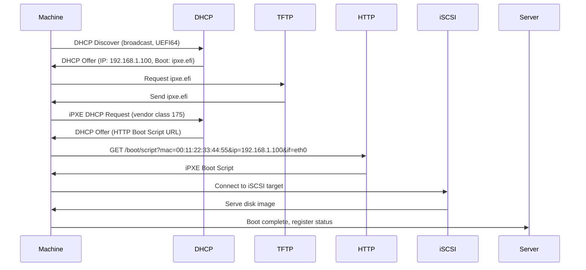

# Network Configuration Module

The Network Configuration module handles PXE boot setup, dnsmasq configuration, IP address management, and Linux configurator functionality.

## Overview

The Network module handles:

- **PXE Boot Setup**: Configuring PXE boot server for physical machines
- **dnsmasq Configuration**: DHCP and DNS configuration via dnsmasq
- **IP Address Management**: IP address allocation and tracking
- **Linux Configurator**: ggnet2-linux-configurator implementation
- **Network Boot**: Serving boot files and images over network

## Architecture



## Components

### PXE Manager (`pxe_manager.py`)

Handles PXE boot server setup and configuration.

**Key Functions:**
- `setup_pxe_server()`: Setup PXE boot server
- `configure_machine_boot(machine_id, mac, system_image)`: Configure boot for machine
- `generate_pxe_config(machine_id, mac, system_image)`: Generate PXE config file
- `remove_machine_boot(machine_id)`: Remove boot configuration for machine
- `get_boot_status(machine_id)`: Get boot status for machine

**PXE Boot Structure (iPXE for Windows 11 UEFI Secure Boot):**
```
/var/lib/tftp/
├── ipxe.efi                 # Main UEFI bootloader (Windows 11)
├── i386-efi/
│   └── ipxe.efi            # 32-bit UEFI bootloader
├── ipxe_202006.efi         # Alternative iPXE version (optional)
├── ipxe_202102.efi         # Alternative iPXE version (optional)
├── snp.efi                 # SNP driver for UEFI network (optional)
└── snponly.efi             # SNP-only driver (optional)
```

**Note:** iPXE boot files are used instead of pxelinux.0 for Windows 11 UEFI Secure Boot support.

**Example:**
```python
from network.pxe_manager import PXEManager

pxe_manager = PXEManager()
pxe_manager.setup_pxe_server()
pxe_manager.configure_machine_boot(
    machine_id="machine-001",
    mac="00:11:22:33:44:55",
    system_image="win11"
)
```

### dnsmasq Manager (`dnsmasq_manager.py`)

Handles dnsmasq configuration for DHCP and DNS.

**Key Functions:**
- `configure_dnsmasq()`: Configure dnsmasq
- `add_dhcp_reservation(mac, ip, hostname)`: Add DHCP reservation
- `remove_dhcp_reservation(mac)`: Remove DHCP reservation
- `reload_dnsmasq()`: Reload dnsmasq configuration
- `get_dnsmasq_status()`: Get dnsmasq status

**dnsmasq Configuration:**
```
/etc/dnsmasq.conf

# DHCP Configuration
dhcp-range=192.168.1.100,192.168.1.200,12h
dhcp-option=option:router,192.168.1.1
dhcp-option=option:dns-server,192.168.1.1

# DHCP Reservations
dhcp-host=00:11:22:33:44:55,192.168.1.100,PC-1

# TFTP Configuration
enable-tftp
tftp-root=/tftpboot
```

**Example:**
```python
from network.dnsmasq_manager import DNSMASQManager

dnsmasq_manager = DNSMASQManager()
dnsmasq_manager.configure_dnsmasq()
dnsmasq_manager.add_dhcp_reservation(
    mac="00:11:22:33:44:55",
    ip="192.168.1.100",
    hostname="PC-1"
)
```

### IP Manager (`ip_manager.py`)

Handles IP address allocation and tracking.

**Key Functions:**
- `allocate_ip(machine_id, mac)`: Allocate IP address for machine
- `release_ip(machine_id)`: Release IP address
- `get_ip(machine_id)`: Get IP address for machine
- `list_allocated_ips()`: List all allocated IP addresses
- `check_ip_availability(ip)`: Check if IP is available

**IP Address Pool:**
```python
{
    "pool_start": "192.168.1.100",
    "pool_end": "192.168.1.200",
    "subnet": "192.168.1.0/24",
    "gateway": "192.168.1.1",
    "dns": "192.168.1.1"
}
```

**Example:**
```python
from network.ip_manager import IPManager

ip_manager = IPManager()
ip = ip_manager.allocate_ip(
    machine_id="machine-001",
    mac="00:11:22:33:44:55"
)
# Returns: "192.168.1.100"
```

### Linux Configurator (`linux_configurator.py`)

Handles Linux system configuration (ggnet2-linux-configurator). This is the equivalent of `ggrock-linux-configurator`.

**Key Functions:**
- `detect_ip_addresses()`: Detect all IP addresses on the server
- `select_ip_address()`: Select IP address for client communication (auto-select if only one)
- `configure_network(interface, ip, netmask, gateway)`: Configure network interface
- `configure_hostname(hostname)`: Configure hostname
- `configure_dns(dns_servers)`: Configure DNS servers
- `configure_static_ip(interface, ip_config)`: Configure static IP
- `create_bridge(nic_name, bridge_name)`: Create network bridge for VMs
- `enable_ip_forwarding()`: Enable IP forwarding
- `apply_configuration()`: Apply all configuration changes

**IP Address Detection:**
```python
from network.linux_configurator import LinuxConfigurator

configurator = LinuxConfigurator()

# Detect all IP addresses
ip_addresses = configurator.detect_ip_addresses()
# Returns: ["192.168.1.10", "10.0.0.5"]

# Auto-select if only one, prompt if multiple
selected_ip = configurator.select_ip_address()
# Returns: "192.168.1.10" (or prompts user if multiple)
```

**Bridge Network Creation:**
```python
# Create bridge network for VMs (vmbr0)
configurator.create_bridge(
    nic_name="eth0",
    bridge_name="vmbr0"
)
```

**Complete Configuration Example:**
```python
from network.linux_configurator import LinuxConfigurator

configurator = LinuxConfigurator()

# Detect and select IP address
selected_ip = configurator.select_ip_address()

# Create bridge for VMs (if enabled)
configurator.create_bridge("eth0", "vmbr0")

# Enable IP forwarding
configurator.enable_ip_forwarding()

# Configure DNS (add default if missing)
configurator.configure_dns(["8.8.8.8"])

# Update dnsmasq with selected IP
configurator.update_dnsmasq_config(selected_ip)

# Apply all changes
configurator.apply_configuration()
```

## PXE Boot Process

### PXE Boot Sequence (iPXE for Windows 11 UEFI Secure Boot)



### HTTP Boot Script Endpoint

**Backend API Endpoint:**
- URL: `/boot/script?mac={mac}&ip={ip}&if={ifname}`
- Method: `GET`
- Returns: iPXE boot script (text/plain)

**Example Request:**
```bash
curl "http://localhost/boot/script?mac=00:11:22:33:44:55&ip=192.168.1.100&if=eth0"
```

**Example Response:**
```ipxe
#!ipxe
dhcp
set base-url http://192.168.1.10
sanboot --no-describe iscsi:192.168.1.10:::1:iqn.ggnet2.client.00-11-22-33-44-55
```

**Script Generation:**
```python
from network.pxe_manager import PXEManager

pxe_manager = PXEManager()

# Generate iPXE boot script
script = pxe_manager.generate_ipxe_script(
    mac="00:11:22:33:44:55",
    ip="192.168.1.100",
    interface="eth0"
)
# Returns: iPXE script string
```

**Script Parameters:**
- `mac`: MAC address of client (from query parameter)
- `ip`: IP address of client (from query parameter)
- `if`: Interface name (from query parameter)

**iPXE Script Components:**
- `#!ipxe`: iPXE shebang
- `dhcp`: DHCP configuration
- `set base-url`: Base URL for server resources
- `sanboot`: iSCSI boot command with target IQN

**iSCSI Target IQN Format:**
```
iqn.ggnet2.client.{mac_address}
# Example: iqn.ggnet2.client.00-11-22-33-44-55
```

### Legacy PXE Configuration (if needed)

**Machine-Specific Config (Legacy BIOS):**
```
default win11
prompt 0
timeout 10

label win11
    kernel memdisk
    append initrd=win11.img raw
    ipappend 2
```

**Config File Path (Legacy):**
```
/tftpboot/pxelinux.cfg/01-00-11-22-33-44-55
```

**MAC Address Format:**
- MAC address: `00:11:22:33:44:55`
- Config file: `01-00-11-22-33-44-55` (prefixed with `01-`)

**Note:** Legacy PXE configuration is only used for legacy BIOS systems. Windows 11 UEFI Secure Boot uses iPXE with HTTP boot script.

## DHCP Configuration

### DHCP Reservations

Static IP assignments for machines:

```python
dnsmasq_manager.add_dhcp_reservation(
    mac="00:11:22:33:44:55",
    ip="192.168.1.100",
    hostname="PC-1"
)
```

**dnsmasq Config:**
```
dhcp-host=00:11:22:33:44:55,192.168.1.100,PC-1
```

### DHCP Options

Common DHCP options:

```python
{
    "router": "192.168.1.1",
    "dns_server": "192.168.1.1",
    "domain": "ggnet2.local",
    "lease_time": "12h"
}
```

## iSCSI Target Setup

### iSCSI Target Configuration

iSCSI targets expose ZFS clones to machines:

```python
from network.pxe_manager import PXEManager

pxe_manager = PXEManager()
pxe_manager.setup_iscsi_target(
    machine_id="machine-001",
    system_clone="/dev/zvol/pool0/ggnet2/clones/machine-001-system",
    game_clone="/dev/zvol/pool0/ggnet2/clones/machine-001-game"
)
```

**iSCSI Target Commands:**
```bash
# Create iSCSI target
targetcli /backstores/block create name=machine-001-system \
  dev=/dev/zvol/pool0/ggnet2/clones/machine-001-system

targetcli /iscsi create iqn.2024-01.ggnet2:machine-001

targetcli /iscsi/iqn.2024-01.ggnet2:machine-001/tpg1/luns \
  create /backstores/block/machine-001-system
```

## IP Address Management

### IP Allocation

Automatic IP allocation from pool:

```python
ip = ip_manager.allocate_ip(
    machine_id="machine-001",
    mac="00:11:22:33:44:55"
)
```

**IP Pool Configuration:**
```python
{
    "pool_start": "192.168.1.100",
    "pool_end": "192.168.1.200",
    "subnet": "192.168.1.0/24",
    "gateway": "192.168.1.1"
}
```

### IP Release

Release IP when machine is deleted:

```python
ip_manager.release_ip("machine-001")
```

## Linux Configurator

### IP Address Detection and Selection

During installation, the configurator automatically detects all IP addresses on the server:

```python
configurator = LinuxConfigurator()

# Detect IP addresses using: ip -4 -br a show scope global
ip_addresses = configurator.detect_ip_addresses()
# Returns: ["192.168.1.10", "10.0.0.5"]

# Auto-select if only one IP, prompt if multiple
selected_ip = configurator.select_ip_address()
# Returns: "192.168.1.10" (auto-selected if only one, prompts user if multiple)
```

**Behavior:**
- If only one IP address is detected, it's automatically selected
- If multiple IP addresses are detected, user is prompted to select one
- Selected IP is saved to `/etc/ggnet2-linux-configurator/target-ip`
- Selected IP is used for dnsmasq configuration and client communication

### Bridge Network Creation

Create network bridge for virtual machines:

```python
# Create bridge network (vmbr0) for VMs
configurator.create_bridge(
    nic_name="eth0",
    bridge_name="vmbr0"
)
```

**Bridge Configuration:**
- Creates bridge interface `vmbr0`
- Moves physical adapter (`eth0`) under bridge
- Configures bridge with STP disabled
- Updates `/etc/network/interfaces`:
  ```
  auto eth0
  iface eth0 inet manual
  
  auto vmbr0
  iface vmbr0 inet static
      address 192.168.1.10
      netmask 255.255.255.0
      gateway 192.168.1.1
      bridge_ports eth0
      bridge_stp off
      bridge_fd 0
  ```
- Restarts networking service after configuration

**Note:** Bridge is only created if VMs are enabled and user confirms during installation.

### IP Forwarding Configuration

Enable IP forwarding for iSCSI routing:

```python
configurator.enable_ip_forwarding()
```

**Configuration:**
- Sets `net.ipv4.ip_forward=1` in `/etc/sysctl.conf`
- Applies immediately: `sysctl -w net.ipv4.ip_forward=1`

**Why:** Windows creates static route to iSCSI target via default gateway, even if on same subnet. Many routers don't forward packets back to originating subnet, causing iSCSI communication to fail. IP forwarding on the server allows it to route packets properly.

### DNS Configuration

Configure DNS servers (with default fallback):

```python
# Check DNS configuration
configurator.check_dns()

# Add default DNS if missing
if not configurator.has_dns():
    configurator.configure_dns(["8.8.8.8"])
```

**Default Behavior:**
- Checks `/etc/resolv.conf` for nameservers
- If no nameservers found, adds `nameserver 8.8.8.8`

### Network Interface Configuration

Configure network interface:

```python
configurator.configure_network(
    interface="eth0",
    ip="192.168.1.10",
    netmask="255.255.255.0",
    gateway="192.168.1.1"
)
```

**Network Config File:**
```
/etc/network/interfaces.d/eth0

auto eth0
iface eth0 inet static
    address 192.168.1.10
    netmask 255.255.255.0
    gateway 192.168.1.1
```

### Hostname Configuration

Configure hostname:

```python
configurator.configure_hostname("ggnet2-server")
```

**Hostname Config:**
```
/etc/hostname: ggnet2-server
/etc/hosts: 127.0.0.1 ggnet2-server
```

### Preflight Checks

The configurator also performs preflight checks (equivalent to `ggrock-preflight`):

```python
configurator.run_preflight_checks()
```

**Checks:**
1. **Linux Headers**: Verifies headers match current kernel version
2. **DNS Configuration**: Verifies nameservers are configured
3. **ZFS Module**: Ensures ZFS module is loaded

**Auto-Fixes:**
- Installs missing Linux headers for current kernel
- Adds default DNS (8.8.8.8) if missing
- Loads ZFS module if not loaded

## Integration with Other Modules

### Machines Module

Network module configures PXE boot for physical machines:

```python
from network.pxe_manager import PXEManager
from machines.physical_manager import PhysicalManager

pxe_manager = PXEManager()
physical_manager = PhysicalManager()

# Register machine and configure PXE boot
machine = physical_manager.register_machine(
    mac="00:11:22:33:44:55",
    name="PC-1",
    ip="192.168.1.100"
)
pxe_manager.configure_machine_boot(
    machine_id=machine["id"],
    mac="00:11:22:33:44:55",
    system_image="win11"
)
```

### Images Module

Network module uses images for PXE boot:

```python
from images.image_manager import ImageManager
from network.pxe_manager import PXEManager

image_manager = ImageManager()
pxe_manager = PXEManager()

# Get system image for PXE boot
image = image_manager.get_image("win11")
pxe_manager.configure_machine_boot(
    machine_id="machine-001",
    mac="00:11:22:33:44:55",
    system_image="win11"
)
```

## Error Handling

**Common Errors:**
- **PXE Server Not Running**: TFTP server not running
- **Config File Not Found**: PXE config file not found
- **IP Already Allocated**: IP address already in use
- **DHCP Reservation Failed**: Failed to add DHCP reservation

**Error Handling:**
```python
from network.exceptions import PXEError, IPError

try:
    pxe_manager.configure_machine_boot(machine_id, mac, system_image)
except PXEError as e:
    logger.error(f"PXE configuration failed: {e}")
except IPError as e:
    logger.error(f"IP allocation failed: {e}")
```

## Development Notes

- PXE boot requires TFTP server to be running
- dnsmasq configuration is reloaded after changes
- IP addresses are tracked in database
- iSCSI targets are created/destroyed dynamically
- Linux configurator modifies system configuration files

## To-Do

- [ ] Implement PXE boot menu system
- [ ] Add network interface bonding
- [ ] Implement VLAN support
- [ ] Add network monitoring
- [ ] Implement network performance tuning
- [ ] Add network security features

