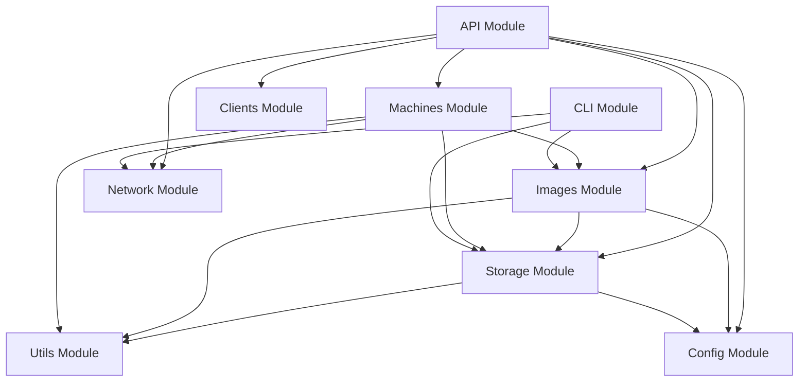

# Backend Overview

The ggnet2 backend is a Python-based application that provides ZFS-based storage management, image management, virtual machine orchestration, and client communication capabilities.

## Architecture

The backend is organized into modular components that handle specific responsibilities:

```
backend/
├── api/              # FastAPI application and routes
├── images/           # Image management and ZFS operations
├── machines/         # VM and physical machine management
├── storage/          # ZFS pool management and monitoring
├── network/          # PXE boot and network configuration
├── clients/          # Windows client management
├── utils/            # Shared utilities
├── config/           # Configuration management
└── cli/              # Command-line interface
```

## Core Modules

### API Module (`api/`)

The API module provides the REST API endpoints and WebSocket/SignalR hubs for client communication.

**Key Components:**
- `main.py`: FastAPI application initialization
- `routes/`: REST API route handlers
  - `images.py`: Image management endpoints
  - `machines.py`: Physical and VM management endpoints
  - `vms.py`: VM-specific endpoints
  - `array.py`: Storage/Array management endpoints
  - `clients.py`: Client management endpoints
  - `settings.py`: Settings endpoints
  - `signalr.py`: SignalR/WebSocket hub endpoints
- `middleware/`: Request middleware (authentication, logging)
- `websocket/`: WebSocket hub implementation

See [API Documentation](api.md) for detailed endpoint documentation.

### Images Module (`images/`)

Manages disk images (System and Game images) using ZFS volumes, snapshots, and clones.

**Key Components:**
- `image_manager.py`: High-level image management API
- `zfs_handler.py`: ZFS volume operations (create, destroy, clone)
- `snapshot_manager.py`: Snapshot creation and management
- `clone_manager.py`: Clone operations for VMs and clients
- `snapshot_retention.py`: Retention policy enforcement

**Workflow:**
1. Create ZFS volume for image (`zvol`)
2. Create base snapshot (`@base`)
3. Create clones for VMs/clients
4. Manage snapshots and retention

See [Images Module](images.md) for detailed documentation.

### Machines Module (`machines/`)

Manages both virtual machines (VMs) and physical machines.

**Key Components:**
- `vm_manager.py`: VM lifecycle management API
- `vm_hypervisor.py`: QEMU/KVM operations via libvirt
- `vm_network_manager.py`: Network vs Local Drives configuration
- `vm_clone_handler.py`: ZFS clone creation for VMs
- `vm_settings.py`: VM settings management
- `vm_enable.py`: Enable VMs functionality and prerequisites
- `physical_manager.py`: Physical machine management

**VM Workflow:**
1. Enable VMs (check prerequisites)
2. Create VM (ZFS clone + libvirt domain)
3. Start/Stop/Reset VM
4. VM Control (VNC/noVNC access)
5. Apply writebacks

See [Virtual Machines](vms.md) and [Physical Machines](machines.md) for detailed documentation.

### Storage Module (`storage/`)

Manages ZFS pools, monitoring, and TRIM operations.

**Key Components:**
- `zfs_pool_manager.py`: ZFS pool operations (create, import, status, scrub)
- `trim_manager.py`: TRIM operations for SSDs (autotrim, manual TRIM)
- `monitoring.py`: Storage monitoring (ARC stats, IO stats, pool health)
- `writeback_manager.py`: Writeback cleanup and management
- `settings_integration.py`: Settings integration

**Features:**
- Pool status and health monitoring
- ARC (Adaptive Replacement Cache) statistics
- TRIM operations for SSD optimization
- Writeback management

See [Storage Management](storage.md) for detailed documentation.

### Network Module (`network/`)

Handles PXE boot configuration, dnsmasq setup, and network management.

**Key Components:**
- `linux_configurator.py`: ggnet2-linux-configurator implementation
- `pxe_manager.py`: PXE boot server setup
- `dnsmasq_manager.py`: dnsmasq configuration for DHCP/DNS
- `ip_manager.py`: IP address management
- `network_types.py`: Network types and constants

**Features:**
- PXE boot server configuration
- DHCP/DNS via dnsmasq
- IP address allocation and tracking
- Network boot image serving

See [Network Configuration](network.md) for detailed documentation.

### Clients Module (`clients/`)

Manages Windows client operations, registry management, and toolchain scripts.

**Key Components:**
- `client_manager.py`: Client management API
- `windows_client.py`: Windows client operations
- `registry_manager.py`: Windows Registry management
- `toolchain_scripts.py`: Registry script generator (.reg files)
- `client_types.py`: Client types and constants

**Features:**
- Client registration and tracking
- Registry script generation
- PC renaming and configuration
- Environment variable injection

See [Client Management](clients.md) for detailed documentation.

### Utils Module (`utils/`)

Shared utilities and helpers used across modules.

**Key Components:**
- `zfs_parser.py`: ZFS command output parsing
- `command_executor.py`: Shell command execution wrapper
- `logger.py`: Logging utilities

### Config Module (`config/`)

Configuration management and settings.

**Key Components:**
- `settings.py`: Settings dataclasses (Pydantic models)
- `zfs_config.py`: ZFS-specific configuration

### CLI Module (`cli/`)

Command-line interface for administrative tasks.

**Key Components:**
- `main.py`: Click CLI interface

See [CLI Tool](cli.md) for detailed documentation.

## Technology Stack

- **Python 3.10+**: Core language
- **FastAPI**: REST API framework
- **libvirt-python**: QEMU/KVM virtualization
- **Pydantic**: Data validation and settings
- **Click**: CLI framework
- **APScheduler**: Task scheduling
- **websockets**: WebSocket support

## Module Interactions



## Development Notes

- All modules use dependency injection for testability
- Shared utilities are centralized in `utils/`
- Configuration is managed via Pydantic models
- Logging is standardized across all modules

## To-Do

- [ ] Add comprehensive error handling and recovery
- [ ] Implement caching layer for frequently accessed data
- [ ] Add metrics collection and monitoring
- [ ] Implement rate limiting for API endpoints
- [ ] Add request/response logging middleware

