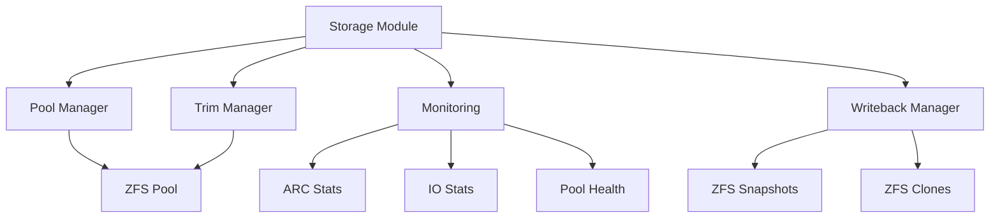

# Storage Management Module

The Storage Management module handles ZFS pool operations, monitoring, TRIM operations, and writeback management.

## Overview

The Storage module handles:

- **ZFS Pool Management**: Pool creation, import, status, scrub, and health monitoring
- **Storage Monitoring**: ARC statistics, IO statistics, pool health
- **TRIM Operations**: Autotrim and manual TRIM for SSD optimization
- **Writeback Management**: Writeback cleanup and management
- **Settings Integration**: Integration with Settings module for configuration

## Architecture



## Components

### ZFS Pool Manager (`zfs_pool_manager.py`)

Handles ZFS pool operations.

**Key Functions:**
- `get_pool_status(pool_name)`: Get pool status and health
- `get_pool_stats(pool_name)`: Get pool statistics
- `get_pool_iostat(pool_name)`: Get pool IO statistics
- `start_scrub(pool_name)`: Start pool scrub
- `get_scrub_status(pool_name)`: Get scrub status
- `create_pool(pool_name, devices)`: Create a new pool
- `import_pool(pool_name)`: Import an existing pool

**Pool Status:**
```python
{
    "pool_name": "pool0",
    "status": "online",
    "size": "10T",
    "allocated": "5T",
    "free": "5T",
    "health": "healthy",
    "topology": {
        "type": "stripe",
        "vdevs": [
            {
                "name": "sda",
                "size": "10T",
                "status": "online"
            }
        ]
    }
}
```

**Example:**
```python
from storage.zfs_pool_manager import ZFSPoolManager

pool_manager = ZFSPoolManager()
status = pool_manager.get_pool_status("pool0")
stats = pool_manager.get_pool_stats("pool0")
```

### Trim Manager (`trim_manager.py`)

Handles TRIM operations for SSD optimization.

**Key Functions:**
- `enable_pool_autotrim(pool_name)`: Enable autotrim on pool
- `disable_pool_autotrim(pool_name)`: Disable autotrim on pool
- `manual_trim(pool_name)`: Perform manual TRIM
- `get_autotrim_status(pool_name)`: Get autotrim status

**TRIM Operations:**
```bash
# Enable autotrim
zpool set autotrim=on pool0

# Manual TRIM
zpool trim pool0

# Check autotrim status
zpool get autotrim pool0
```

**Example:**
```python
from storage.trim_manager import TrimManager

trim_manager = TrimManager()
trim_manager.enable_pool_autotrim("pool0")
trim_manager.manual_trim("pool0")
```

### Monitoring (`monitoring.py`)

Handles storage monitoring and statistics.

**Key Functions:**
- `get_arc_stats()`: Get ARC (Adaptive Replacement Cache) statistics
- `get_io_stats(pool_name)`: Get IO statistics
- `get_pool_health(pool_name)`: Get pool health status
- `get_pool_usage(pool_name)`: Get pool usage breakdown

**ARC Statistics:**
```python
{
    "available": True,
    "method": "procfs",  # or "sysctl" or "iostat_fallback"
    "hits": 1000000,
    "misses": 50000,
    "hit_rate": 0.95,
    "size": "2G",
    "max_size": "4G"
}
```

**ARC Stats Methods:**
1. **procfs**: Read from `/proc/spl/kstat/zfs/arcstats`
2. **sysctl**: Read from `sysctl kstat.zfs.misc.arcstats`
3. **iostat_fallback**: Use IO stats as fallback

**Example:**
```python
from storage.monitoring import StorageMonitor

monitor = StorageMonitor()
arc_stats = monitor.get_arc_stats()
io_stats = monitor.get_io_stats("pool0")
health = monitor.get_pool_health("pool0")
```

### Writeback Manager (`writeback_manager.py`)

Handles writeback cleanup and management.

**Key Functions:**
- `list_writebacks(machine_id)`: List writebacks for a machine
- `apply_writebacks(machine_id)`: Apply writebacks to base image
- `discard_writebacks(machine_id)`: Discard writebacks
- `cleanup_old_writebacks(max_age_days)`: Cleanup old writebacks

**Writeback Structure:**
```
pool0/ggnet2/clones/machine-001-system@writeback-2024-01-01
pool0/ggnet2/clones/vm-001-system@writeback-2024-01-01
```

**Example:**
```python
from storage.writeback_manager import WritebackManager

writeback_manager = WritebackManager()
writebacks = writeback_manager.list_writebacks("machine-001")
writeback_manager.apply_writebacks("machine-001")
writeback_manager.cleanup_old_writebacks(max_age_days=7)
```

## Pool Operations

### Create Pool

```python
pool_manager.create_pool(
    pool_name="pool0",
    devices=["/dev/sda", "/dev/sdb"],
    topology="stripe"  # or "mirror", "raidz", etc.
)
```

**ZFS Command:**
```bash
zpool create -f pool0 /dev/sda /dev/sdb
```

### Import Pool

```python
pool_manager.import_pool("pool0")
```

**ZFS Command:**
```bash
zpool import pool0
```

### Pool Scrub

Scrub checks data integrity:

```python
pool_manager.start_scrub("pool0")
status = pool_manager.get_scrub_status("pool0")
```

**ZFS Command:**
```bash
zpool scrub pool0
zpool status pool0
```

### Pool Status

```python
status = pool_manager.get_pool_status("pool0")
# Returns: {
#   "pool_name": "pool0",
#   "status": "online",
#   "size": "10T",
#   "allocated": "5T",
#   "free": "5T",
#   "health": "healthy",
#   "topology": {...}
# }
```

## Monitoring

### ARC Statistics

ARC (Adaptive Replacement Cache) statistics:

```python
arc_stats = monitor.get_arc_stats()
# Returns: {
#   "available": True,
#   "method": "procfs",
#   "hits": 1000000,
#   "misses": 50000,
#   "hit_rate": 0.95,
#   "size": "2G",
#   "max_size": "4G"
# }
```

**Alternative Methods:**
- If `/proc/spl/kstat/zfs/arcstats` is not available, use `sysctl`
- If `sysctl` is not available, use IO stats as fallback

### IO Statistics

IO statistics for pool:

```python
io_stats = monitor.get_io_stats("pool0")
# Returns: {
#   "read": 1000000,
#   "write": 500000,
#   "read_ops": 10000,
#   "write_ops": 5000,
#   "read_bw": "100MB/s",
#   "write_bw": "50MB/s"
# }
```

**ZFS Command:**
```bash
zpool iostat -v pool0 1
```

### Pool Health

Pool health status:

```python
health = monitor.get_pool_health("pool0")
# Returns: {
#   "status": "healthy",
#   "errors": [],
#   "warnings": []
# }
```

## TRIM Operations

### Autotrim

Enable autotrim for automatic SSD optimization:

```python
trim_manager.enable_pool_autotrim("pool0")
```

**ZFS Command:**
```bash
zpool set autotrim=on pool0
```

### Manual TRIM

Perform manual TRIM:

```python
trim_manager.manual_trim("pool0")
```

**ZFS Command:**
```bash
zpool trim pool0
```

## Writeback Management

### Apply Writebacks

Apply writebacks to base image:

```python
writeback_manager.apply_writebacks("machine-001")
```

**Process:**
1. List writeback snapshots for machine
2. Merge writebacks into base image
3. Delete writeback snapshots

### Discard Writebacks

Discard writebacks without applying:

```python
writeback_manager.discard_writebacks("machine-001")
```

**Process:**
1. List writeback snapshots for machine
2. Delete writeback snapshots

### Cleanup Old Writebacks

Cleanup writebacks older than specified days:

```python
writeback_manager.cleanup_old_writebacks(max_age_days=7)
```

## Integration with Other Modules

### Images Module

Storage module provides pool status for images:

```python
from storage.zfs_pool_manager import ZFSPoolManager
from images.image_manager import ImageManager

pool_manager = ZFSPoolManager()
pool_status = pool_manager.get_pool_status("pool0")

if pool_status["free"] < "10G":
    raise InsufficientSpaceError("Not enough space in pool")
```

### Machines Module

Storage module handles writebacks for machines:

```python
from storage.writeback_manager import WritebackManager
from machines.physical_manager import PhysicalManager

writeback_manager = WritebackManager()
physical_manager = PhysicalManager()

# Apply writebacks when machine is shut down
writeback_manager.apply_writebacks("machine-001")
```

## Error Handling

**Common Errors:**
- **Pool Not Found**: Pool does not exist
- **Insufficient Space**: Not enough space in pool
- **Scrub In Progress**: Scrub already running
- **TRIM Not Supported**: TRIM not supported on this pool

**Error Handling:**
```python
from storage.exceptions import PoolError, TrimError

try:
    pool_manager.start_scrub("pool0")
except PoolError as e:
    logger.error(f"Pool operation failed: {e}")
except TrimError as e:
    logger.error(f"TRIM operation failed: {e}")
```

## Development Notes

- All ZFS operations use `subprocess` to execute `zfs`/`zpool` commands
- ARC statistics are read from `/proc/spl/kstat/zfs/arcstats` when available
- TRIM operations require SSDs with TRIM support
- Writeback cleanup runs on a schedule (daily)
- Pool scrub runs on a schedule (weekly)

## To-Do

- [ ] Implement pool expansion (add devices)
- [ ] Add pool replication (send/receive)
- [ ] Implement pool encryption
- [ ] Add pool compression statistics
- [ ] Implement pool performance tuning
- [ ] Add pool alerting (health warnings)

