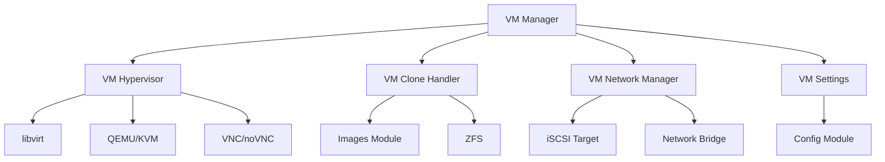
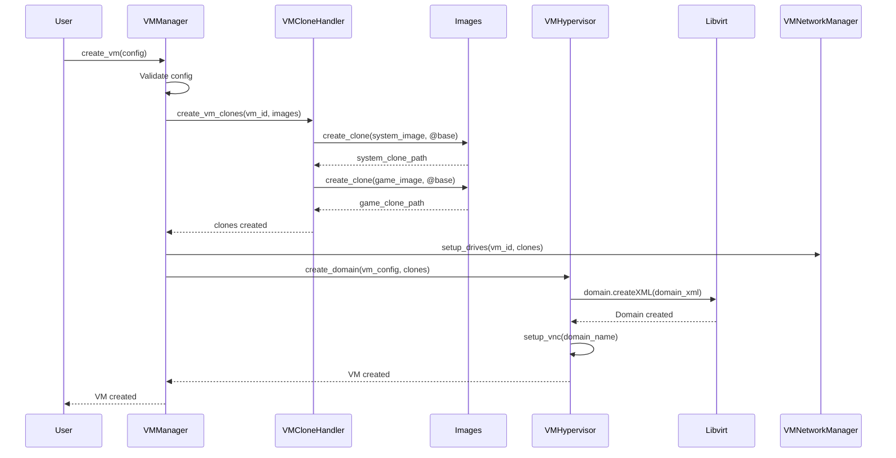

# Virtual Machines Module

The Virtual Machines (VM) module manages the lifecycle of virtual machines using QEMU/KVM via libvirt. It integrates with the Images module to create clones and provides web-based console access via VNC/noVNC.

## Overview

The VM module handles:

- **VM Lifecycle**: Creation, start, stop, reset, and deletion
- **Hypervisor Integration**: QEMU/KVM operations via libvirt
- **Network Configuration**: Local Drives vs Network mode
- **Console Access**: VNC/noVNC setup for web-based access
- **Resource Management**: CPU, RAM, and storage allocation
- **Image Integration**: Creating and managing clones for VMs

## Architecture



## Components

### VM Manager (`vm_manager.py`)

High-level API for VM management operations.

**Key Functions:**
- `create_vm(vm_config)`: Create a new VM
- `list_vms()`: List all VMs
- `get_vm(vm_id)`: Get VM details
- `update_vm(vm_id, vm_config)`: Update VM settings
- `delete_vm(vm_id)`: Delete a VM
- `start_vm(vm_id)`: Start a VM
- `stop_vm(vm_id)`: Force stop a VM
- `shutdown_vm(vm_id)`: Graceful shutdown a VM
- `reboot_vm(vm_id)`: Graceful reboot a VM
- `reset_vm(vm_id)`: Reset a VM (stop and start)

**Example:**
```python
from machines.vm_manager import VMManager

vm_manager = VMManager()
vm = vm_manager.create_vm({
    "name": "VM-1",
    "system_image": "win11",
    "game_image": "games",
    "vcpus": 4,
    "ram": "8G",
    "boot_mode": "uefi",
    "drives_connection": "local"
})
```

### VM Hypervisor (`vm_hypervisor.py`)

Handles QEMU/KVM operations via libvirt.

**Key Functions:**
- `create_domain(vm_config)`: Create libvirt domain
- `start_domain(domain_name)`: Start domain
- `stop_domain(domain_name)`: Stop domain
- `shutdown_domain(domain_name)`: Graceful shutdown domain
- `reboot_domain(domain_name)`: Reboot domain
- `reset_domain(domain_name)`: Reset domain
- `get_domain_info(domain_name)`: Get domain information
- `setup_vnc(domain_name)`: Setup VNC server for domain
- `get_vnc_url(domain_name)`: Get VNC connection URL

**Domain XML Generation:**
```python
from machines.vm_hypervisor import VMHypervisor

hypervisor = VMHypervisor()
domain_xml = hypervisor.generate_domain_xml({
    "name": "VM-1",
    "vcpus": 4,
    "ram": "8G",
    "boot_mode": "uefi",
    "system_disk": "/dev/zvol/pool0/ggnet2/clones/vm-001-system",
    "game_disk": "/dev/zvol/pool0/ggnet2/clones/vm-001-game"
})
```

**Libvirt Connection:**
```python
import libvirt

conn = libvirt.open('qemu:///system')
domain = conn.lookupByName('VM-1')
domain.create()  # Start VM
```

### VM Network Manager (`vm_network_manager.py`)

Handles network configuration for VMs (Local Drives vs Network mode).

**Local Drives Mode:**
- Direct attachment of ZFS volumes to VM
- Maximum performance (no network overhead)
- Uses `/dev/zvol/pool0/ggnet2/clones/vm-XXX-system`

**Network Mode:**
- iSCSI target setup for network boot
- Useful for troubleshooting client boot issues
- Uses iSCSI target to expose ZFS volumes over network

**Key Functions:**
- `setup_local_drives(vm_id, system_clone, game_clone)`: Setup local drives
- `setup_network_drives(vm_id, system_clone, game_clone)`: Setup network drives
- `create_iscsi_target(vm_id, clone_path)`: Create iSCSI target
- `destroy_iscsi_target(vm_id)`: Destroy iSCSI target

**Example:**
```python
from machines.vm_network_manager import VMNetworkManager

network_manager = VMNetworkManager()

if drives_connection == "local":
    network_manager.setup_local_drives(
        vm_id="vm-001",
        system_clone="/dev/zvol/pool0/ggnet2/clones/vm-001-system",
        game_clone="/dev/zvol/pool0/ggnet2/clones/vm-001-game"
    )
else:
    network_manager.setup_network_drives(
        vm_id="vm-001",
        system_clone="/dev/zvol/pool0/ggnet2/clones/vm-001-system",
        game_clone="/dev/zvol/pool0/ggnet2/clones/vm-001-game"
    )
```

### VM Clone Handler (`vm_clone_handler.py`)

Creates and manages ZFS clones for VMs.

**Key Functions:**
- `create_vm_clones(vm_id, system_image, game_image)`: Create clones for VM
- `destroy_vm_clones(vm_id)`: Destroy clones for VM
- `get_clone_paths(vm_id)`: Get clone paths for VM

**Clone Structure:**
```
pool0/ggnet2/clones/vm-001-system  # System image clone
pool0/ggnet2/clones/vm-001-game    # Game image clone
```

**Example:**
```python
from machines.vm_clone_handler import VMCloneHandler

clone_handler = VMCloneHandler()
clones = clone_handler.create_vm_clones(
    vm_id="vm-001",
    system_image="win11",
    game_image="games"
)
# Returns: {
#   "system": "/dev/zvol/pool0/ggnet2/clones/vm-001-system",
#   "game": "/dev/zvol/pool0/ggnet2/clones/vm-001-game"
# }
```

### VM Settings (`vm_settings.py`)

Manages VM settings and configuration.

**Key Functions:**
- `get_vm_settings(vm_id)`: Get VM settings
- `update_vm_settings(vm_id, settings)`: Update VM settings
- `validate_vm_settings(settings)`: Validate VM settings

**VM Settings Structure:**
```python
{
    "name": "VM-1",
    "system_image": "win11",
    "game_image": "games",
    "vcpus": 4,
    "ram": "8G",
    "boot_mode": "uefi",  # "legacy" or "uefi"
    "drives_connection": "local",  # "local" or "network"
    "max_boot_ram": "32G",  # Global limit
    "system_image_snapshot": "@base",
    "game_image_snapshot": "@base",
    "keep_writebacks": False
}
```

### VM Enable (`vm_enable.py`)

Handles enabling VMs functionality and prerequisite checks.

**Key Functions:**
- `check_prerequisites()`: Check all prerequisites
- `enable_vms()`: Enable VMs functionality
- `is_vms_enabled()`: Check if VMs are enabled

**Prerequisites:**
1. **Virtualization**: Check `/proc/cpuinfo` for `vmx` (Intel) or `svm` (AMD)
2. **QEMU/KVM**: Check if QEMU/KVM packages are installed
3. **libvirt**: Check if libvirt daemon is running
4. **Static IP**: Check if static IP is configured (auto-detected during installation)
5. **ZFS Pool**: Check if ZFS pool is available
6. **Bridge Network**: Check if bridge network (`vmbr0`) is configured (created during installation if VMs enabled)

**Example:**
```python
from machines.vm_enable import VMEnable

vm_enable = VMEnable()
prerequisites = vm_enable.check_prerequisites()

if prerequisites["all_passed"]:
    vm_enable.enable_vms()
else:
    print(f"Prerequisites not met: {prerequisites['failed']}")
```

## VM Creation Workflow



## VM Control Operations

### Start VM
```python
vm_manager.start_vm("vm-001")
# Equivalent to: domain.create()
```

### Stop VM (Force)
```python
vm_manager.stop_vm("vm-001")
# Equivalent to: domain.destroy()
```

### Shutdown VM (Graceful)
```python
vm_manager.shutdown_vm("vm-001")
# Equivalent to: domain.shutdown()
```

### Reboot VM (Graceful)
```python
vm_manager.reboot_vm("vm-001")
# Equivalent to: domain.reboot()
```

### Reset VM
```python
vm_manager.reset_vm("vm-001")
# Equivalent to: domain.destroy() then domain.create()
```

## VNC/noVNC Setup

### VNC Server Configuration

VNC server is automatically configured when VM is created:

```python
# Domain XML includes VNC graphics
<graphics type='vnc' port='5900' autoport='yes' listen='0.0.0.0'>
  <listen type='address' address='0.0.0.0'/>
</graphics>
```

**VNC Configuration:**
- Port: `5900` (automatic port assignment)
- Listen: `0.0.0.0` (all interfaces)
- Authentication: Password-based (configured via libvirt)

### noVNC Service Setup

noVNC service provides web-based VNC access via websockify:

**Systemd Service:** `ggnet2-novnc.service`

**Service Configuration:**
```ini
[Unit]
Description=ggnet2 VNC client for VMs
After=network.target

[Service]
ExecStart=/usr/bin/websockify --web=/usr/share/novnc \
  --token-plugin TokenFile \
  --token-source /etc/ggnet2/websockify/target.config.d/ \
  127.0.0.1:6080
Restart=always
RestartSec=2
```

**Token-Based Access:**
- Uses `TokenFile` plugin for token-based VNC access
- Token source directory: `/etc/ggnet2/websockify/target.config.d/`
- Tokens are managed by backend API
- Each VM gets a unique token for secure access

**Service Management:**
```bash
# Start VNC service
systemctl start ggnet2-novnc

# Enable VNC service (start on boot)
systemctl enable ggnet2-novnc

# Check VNC service status
systemctl status ggnet2-novnc
```

### Nginx Proxy Setup

Nginx reverse proxy configuration for VNC access:

**Location Blocks:**
```nginx
# VNC console access (noVNC)
location = /vnc/console {
    proxy_pass http://vnc_proxy/vnc.html;
}

location /vnc/ {
    proxy_pass http://vnc_proxy/;
}

# WebSocket proxy for VNC
location /websockify {
    proxy_http_version 1.1;
    proxy_pass http://vnc_proxy/;
    proxy_set_header Upgrade $http_upgrade;
    proxy_set_header Connection "upgrade";
    
    # VNC connection timeout
    proxy_read_timeout 61s;
    
    # Disable cache
    proxy_buffering off;
}
```

**Upstream Configuration:**
```nginx
upstream vnc_proxy {
    server 127.0.0.1:6080;
}
```

**Access URLs:**
- VNC Console: `https://localhost/vnc/console`
- VNC Static Files: `https://localhost/vnc/`
- WebSocket Proxy: `wss://localhost/websockify`

### noVNC Integration

noVNC provides web-based VNC access:

```python
from machines.vm_hypervisor import VMHypervisor

hypervisor = VMHypervisor()
vnc_url = hypervisor.get_vnc_url("vm-001")
# Returns: "https://localhost/vnc/console?token=vm-001-token"
```

**Token-Based Access Example:**
```python
# Get VNC URL with token
vnc_url = hypervisor.get_vnc_url("vm-001")
# Returns: "https://localhost/vnc/console?token=abc123def456"

# Get VNC control data
control = vm_manager.get_vm_control("vm-001")
# Returns: {
#   "vnc_url": "https://localhost/vnc/console?token=abc123def456",
#   "vnc_token": "abc123def456",
#   "vnc_port": 5900,
#   "vnc_host": "localhost"
# }
```

### WebSocket Proxy

WebSocket proxy (websockify) bridges VNC to WebSocket:

**Manual Setup:**
```bash
websockify --web=/usr/share/novnc \
  --token-plugin TokenFile \
  --token-source /etc/ggnet2/websockify/target.config.d/ \
  127.0.0.1:6080
```

**Configuration:**
- Web directory: `/usr/share/novnc` (noVNC static files)
- Token plugin: `TokenFile` (file-based token authentication)
- Token source: `/etc/ggnet2/websockify/target.config.d/` (token directory)
- Listen address: `127.0.0.1:6080` (local only, accessed via Nginx)

**Token File Format:**
```
/etc/ggnet2/websockify/target.config.d/vm-001
127.0.0.1:5900
```

**Token Management:**
- Tokens are created when VM is started
- Tokens are stored in `/etc/ggnet2/websockify/target.config.d/`
- Token file name: `{vm_id}`
- Token file content: `{vnc_host}:{vnc_port}`
- Tokens are deleted when VM is stopped

### WebSocket Timeout Configuration

**Nginx Timeout Settings:**
```nginx
location /websockify {
    proxy_read_timeout 61s;  # VNC connection timeout
    proxy_buffering off;     # Disable cache for WebSocket
}
```

**Why 61s timeout:**
- VNC connections may have long idle periods
- 61s prevents premature connection closure
- Allows for interactive VNC sessions

**WebSocket Buffering:**
- `proxy_buffering off` - Disables buffering for real-time VNC
- Required for responsive VNC connections

## Resource Management

### CPU Allocation

vCPUs are allocated from physical CPU threads:

```python
# Each vCPU consumes one thread
vm_config = {
    "vcpus": 4,  # Uses 4 CPU threads
    "ram": "8G"
}
```

### RAM Allocation

RAM is allocated from physical memory:

```python
# Maximum Boot RAM Size limits total RAM for all VMs
max_boot_ram = settings.get("max_vm_ram", "32G")
```

### Storage Allocation

Storage comes from ZFS clones (copy-on-write):

```python
# Clones share base image data
# Only changes are stored separately
clone_size = get_clone_size("vm-001-system")
```

## Integration with Other Modules

### Images Module

VMs use clones from the Images module:

```python
from images.clone_manager import CloneManager
from machines.vm_clone_handler import VMCloneHandler

clone_manager = CloneManager()
clone_handler = VMCloneHandler()

# Create clones for VM
clones = clone_handler.create_vm_clones(
    vm_id="vm-001",
    system_image="win11",
    game_image="games"
)
```

### Storage Module

VMs use ZFS volumes from the Storage module:

```python
from storage.zfs_pool_manager import ZFSPoolManager

pool_manager = ZFSPoolManager()
pool_status = pool_manager.get_pool_status("pool0")
```

### Network Module

VMs can use network mode for iSCSI boot:

```python
from network.iscsi_manager import iSCSIManager

iscsi_manager = iSCSIManager()
iscsi_manager.create_target("vm-001", "/dev/zvol/pool0/ggnet2/clones/vm-001-system")
```

## Error Handling

**Common Errors:**
- **Prerequisites Not Met**: Virtualization not enabled, libvirt not running
- **Insufficient Resources**: Not enough CPU/RAM available
- **Clone Creation Failed**: Image not found, insufficient space
- **Domain Creation Failed**: Invalid configuration, libvirt error

**Error Handling:**
```python
from machines.exceptions import VMError, PrerequisitesError

try:
    vm = vm_manager.create_vm(config)
except PrerequisitesError as e:
    logger.error(f"Prerequisites not met: {e}")
except VMError as e:
    logger.error(f"VM creation failed: {e}")
```

## Development Notes

- All libvirt operations use the `libvirt-python` binding
- Domain XML is generated dynamically based on VM configuration
- VNC passwords are generated randomly for each VM
- Clones are automatically cleaned up when VMs are deleted
- Resource limits are enforced at the hypervisor level

## To-Do

- [ ] Implement VM migration (live migration)
- [ ] Add VM snapshots (libvirt snapshots)
- [ ] Implement VM templates
- [ ] Add VM resource usage monitoring
- [ ] Implement VM autostart on boot
- [ ] Add VM backup/restore functionality

