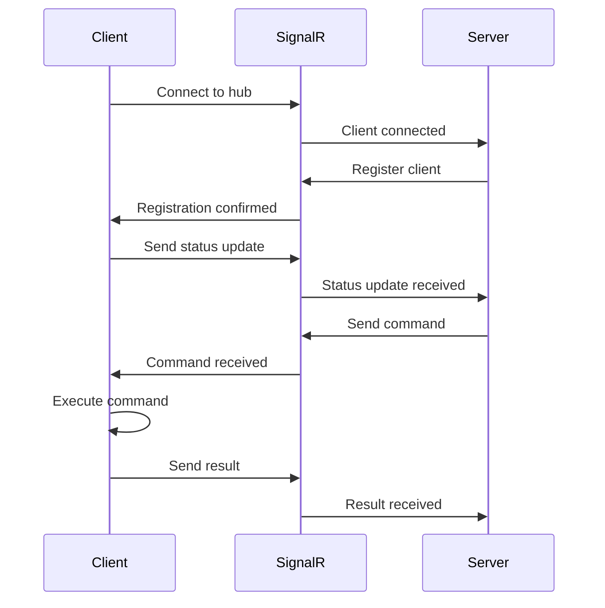

# Windows Client Overview

The ggnet2 Windows Client is a Windows Service application that runs on physical client machines to provide real-time communication with the ggnet2 server.

## Architecture

The Windows Client provides:

- **Real-time Communication**: SignalR/WebSocket connection to server
- **PC Management**: Hostname renaming, environment variable injection
- **Registry Operations**: Windows Registry management
- **WMI Operations**: Windows Management Instrumentation
- **Status Reporting**: System status reporting to server

## Implementation Options

The Windows Client can be implemented in two ways:

### .NET Implementation (Primary)

- **Technology**: .NET 6.0/8.0 Windows Service
- **SignalR Client**: Microsoft.AspNetCore.SignalR.Client
- **Registry**: Microsoft.Win32.Registry
- **WMI**: Microsoft.Management.Infrastructure
- **Logging**: Serilog

**Pros:**
- Native Windows integration
- Excellent SignalR support
- Strong typing and performance
- Rich ecosystem

### Python Implementation (Alternative)

- **Technology**: Python 3.10+ Windows Service
- **WebSocket Client**: websockets library
- **Registry**: winreg (built-in)
- **WMI**: wmi library
- **Service**: pywin32

**Pros:**
- Easier to develop and debug
- Cross-platform compatibility
- Simpler deployment

## Project Structure

```
windows_client/
├── ggnet2-toolchain/          # .NET implementation
│   ├── src/
│   │   ├── Program.cs
│   │   ├── Service/
│   │   │   └── ToolchainService.cs
│   │   ├── SignalR/
│   │   │   └── HubConnection.cs
│   │   ├── Registry/
│   │   │   └── RegistryManager.cs
│   │   ├── WMI/
│   │   │   └── WMIManager.cs
│   │   └── Models/
│   │       └── Messages.cs
│   ├── ggnet2-toolchain.csproj
│   └── appsettings.json
└── python_client/            # Python implementation
    ├── src/
    │   ├── main.py
    │   ├── service.py
    │   ├── websocket_client.py
    │   ├── registry_manager.py
    │   └── wmi_manager.py
    └── requirements.txt
```

## Features

### Real-time Communication

- **SignalR/WebSocket Connection**: Maintains persistent connection to server
- **Event Handling**: Handles server commands and events
- **Status Updates**: Sends periodic status updates to server
- **Heartbeat**: Sends heartbeat to maintain connection

### PC Management

- **Hostname Renaming**: Renames PC hostname
- **Environment Variables**: Injects environment variables
- **Registry Configuration**: Configures Windows Registry
- **System Information**: Reports system information to server

### Registry Operations

- **Registry Scripts**: Applies registry scripts (.reg files)
- **Registry Keys**: Manages registry keys and values
- **Configuration**: Stores client configuration in registry

### WMI Operations

- **System Information**: Queries system information via WMI
- **Hardware Information**: Queries hardware information
- **Performance Metrics**: Collects performance metrics

## Communication Flow



## Deployment

### .NET Client

See [.NET Client](dotnet_client.md) for .NET implementation details.

### Python Client

See [Python Client](python_client.md) for Python implementation details.

### Deployment

See [Deployment](deployment.md) for deployment instructions.

## Development Notes

- Windows Service must run with appropriate permissions
- Registry operations require administrator privileges
- SignalR connection requires network access to server
- Status updates are sent periodically (every 30 seconds)
- Heartbeat is sent every 60 seconds

## To-Do

- [ ] Add client authentication
- [ ] Implement client update mechanism
- [ ] Add client health monitoring
- [ ] Implement client remote desktop
- [ ] Add client performance metrics
- [ ] Implement client logging

